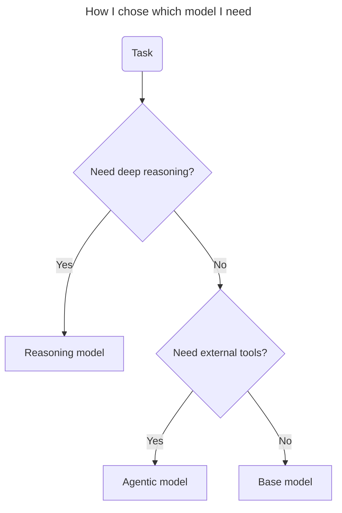

# How I use llms as a Software Developer

## Alexander Opalic

---
layout: image
image: /images/cover.png
backgroundSize: contain
---

---
layout: intro
glowSeed: 15
glowOpacity: 0.3
class: 'pl-30'
---

# Alexander Opalic

  

  
Senior Full Stack Developer

  
at

  
Otto Payments 🦞

  7 years of development experience in the Munich Area

  I write blog posts at alexop.dev - check them out!

  <ContactItem
    iconClass="i-carbon-user"
    text="alexop.dev"
    color="#60A5FA"
  />
  <ContactItem
    iconClass="i-carbon-logo-github"
    text="alexanderop"
    color="#A78BFA"
  />
  <ContactItem
    iconClass="i-carbon-email"
    text="alex.opalic.dev@gmail.com"
    color="#4ADE80"
  />
  <ContactItem
    iconClass="i-carbon-logo-x"
    text="@alexanderopalic"
    color="#3B82F6"
  />

---

# How LLMs Learn

### (the *really* short version)

1. <strong>Pre‑training</strong> – The model reads a huge collection of text and code to learn how to predict the next word.

2. <strong>Fine‑tuning</strong> – We teach the model using specific examples and questions to make it better at certain tasks.

3. <strong>Human Feedback</strong> – People rate the model's responses to help it give better answers.

  <small>Under the hood, they're still just predicting <strong>the next token</strong> given everything so far.</small>

---
layout: iframe
url: https://tiktokenizer.vercel.app
---

---
layout: center
---

---
layout: image
image: 'images/chooseTheRightLlmModel.png'
backgroundSize: contain
---

---
layout: center
---

<Tweet id='1921216202090967237'/>

---
layout: iframe-right
url: 'https://simonwillison.net/2025/Apr/26/o3-photo-locations/'
---

# o3 Photo Location Finder - Quick Guide

- **What it does:** The o3 model finds where photos were taken, even without clear landmarks
- **How it works:** It looks at things like plants, buildings, and small details (like car plates)
- **Example:** Someone shared a California photo. The model found it was on the Central Coast but not the exact city

---
layout: center
---

---
layout: image
image: '/images/catDragonball.png'
backgroundSize: contain
---

---
layout: center
---

<SlidevVideo class="h-[500px]" autoplay controls>
  <source src="./images/tab-tab-tab-mp4.mp4" type="video/mp4" />
</SlidevVideo>
---
layout: center
---

<SlidevVideo class="h-[900px]" autoplay controls>
  <source src="./images/knows-your-codebase.mp4" type="video/mp4" />
</SlidevVideo>

---
layout: center
---

<SlidevVideo class="h-[500px]" autoplay controls>
  <source src="./images/inline-refactoring.mp4" type="video/mp4" />
</SlidevVideo>

---
layout: image
image: 'images/improveLlm.png'
backgroundSize: contain
---

---
layout: image
image: 'images/learnPromptEngeniering.png'
backgroundSize: contain
---

---
layout: image
image: 'images/systemPrompt.png'
backgroundSize: contain
---

---
layout: image-right
image: '/images/goggelingISDead.png'
---

## Web Search with LLMs vs Google

<article class="prose prose-lg">
  

    <h3 class="text-xl font-semibold mb-2">Google Search Issues</h3>
    

      Declining quality due to ads and SEO manipulation
    

  

  

    <h3 class="text-xl font-semibold mb-2">LLM Advantages</h3>
    <ul class="list-disc pl-6 mt-2">
      <li>Parallel search processing</li>
      <li>Concise, focused responses</li>
      <li>Time-efficient research</li>
    </ul>
  

</article>

---
layout: image-right
image: 'images/bruceExtractCodebase.png'
---

# Extracting Codebase Content for LLM Analysis

1. Find your target repository (e.g., https://github.com/vueuse/vueuse)
2. Replace "github" with "uithub" in the URL
3. This will display the entire codebase as plain text
4. Copy the content and paste it into your LLM to:
   - Ask specific questions about the codebase
   - Generate proof-of-concepts
   - Analyze implementation patterns

---
layout: iframe-right
url: https://deepwiki.com/alexanderop/vue-vector-search
---

# Deepwiki

1. Visit [Deepwiki](https://deepwiki.com/)
2. Upload your source project (open-source or private)
3. Let the tool automatically index your codebase
4. Get comprehensive documentation generated
5. Review and refine the generated docs as needed

<small>Note: Created by the Devin AI team, this tool offers free indexing for your projects.</small>

---
layout: iframe
url: "https://alexop.dev/posts/how-to-use-ai-for-effective-diagram-creation-a-guide-to-chatgpt-and-mermaid/"
---

---
layout: iframe
url: "https://mermaid.live/edit#pako:eNpVjs1ugzAQhF_F2lMrkYjwEwcfKjWkzSVSKzWnQg4rcDBKsJExSlPg3WtIW7V7mtV8M7sdZCrnwOB4VpdMoDZkv0klsfOYxEKXjamwOZDZ7KHfckMqJfm1J-u7rSKNUHVdyuL-xq9HiMTdbsQ4MaKUp-FmxVP-RfKebJId1kbVh7_O_qJ68pSUr8LW_3eE5jb1nByRHXGWoSYx6gM4UHFdYZnb17sxkIIRvOIpMCtz1KcUUjlYDluj3q4yA2Z0yx3Qqi0E2LJzY7e2ztHwTYmFxuoHqVG-K_W7Fno8853mMuc6Vq00wBZ0YoF18AHMD4L5Kggiz6cu9axYOnAFFnrzIIoi6kVh4Ef-YhEODnxO9e58RUPXjrd0KXW90Bu-AIZjeo4"
---

---
layout: center
---

<Tweet id="1617979122625712128"/>

---
layout: center
---

# The Future is Agentic

[web development workflow](https://docs.cursor.com/guides/tutorials/web-development)

---
layout: image
image: 'https://media.licdn.com/dms/image/v2/C4D12AQEEUZUGltmQog/article-cover_image-shrink_600_2000/article-cover_image-shrink_600_2000/0/1535653358794?e=2147483647&v=beta&t=2j2XltOC8FKIQowEo84ywe_4kbEEIUrxENn6fxlWehU'
backgroundSize: contain
---

---
layout: image
image: 'images/modularMonlith.png'
backgroundSize: contain
---

---
layout: image
image: 'images/customInstraction.png'
backgroundSize: contain
---

---
layout: image
image: 'images/keyTakeaways.png'
backgroundSize: contain
---

---
layout: iframe
url: 'https://alexop.dev/tags/ai/'
---

