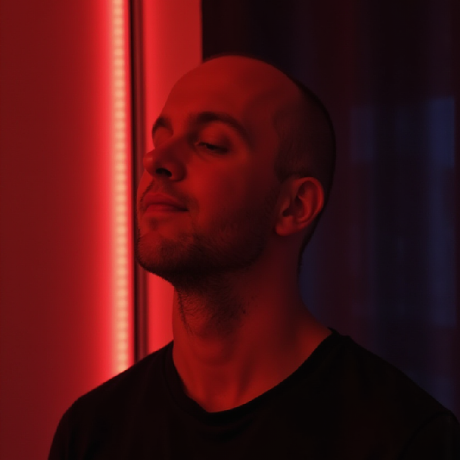

---
layout: image
image: 'images/cover.png'
backgroundSize: contain
---

---
layout: intro
glowSeed: 15
glowOpacity: 0.3
class: 'pl-30'
---

# Alexander Opalic

<div class="absolute top-20 right-30 flex flex-col items-center">
  
</div>

<div class="text-xl opacity-80 mb-4 flex items-center gap-2">
  <div class="opacity-50">Senior Full Stack Developer</div>
  <div>at</div>
  <div class="opacity-80">Otto Payments 🦞</div>
</div>

<div class="text-lg opacity-70 mb-8">
  7 years of development experience in the Munich Area
</div>

<div class="text-lg opacity-70 mb-8 text-primary font-bold">
  I write blog posts at alexop.dev - check them out!
</div>

<div class="flex flex-wrap gap-2 my-8">
  <ContactItem
    iconClass="i-carbon-user"
    text="alexop.dev"
    color="#60A5FA"
  />
  <ContactItem
    iconClass="i-carbon-logo-github"
    text="alexanderop"
    color="#A78BFA"
  />
  <ContactItem
    iconClass="i-carbon-email"
    text="alex.opalic.dev@gmail.com"
    color="#4ADE80"
  />
  <ContactItem
    iconClass="i-carbon-logo-x"
    text="@alexanderopalic"
    color="#3B82F6"
  />
</div>

---
layout: image
image: 'images/chooseTheRightLlmModel.png'
backgroundSize: contain
---

---
layout: image
image: 'images/03Mini.jpeg'
backgroundSize: contain
---

---
layout: image
image: 'images/geo.png'
backgroundSize: contain
---

---
layout: image
image: '/images/catDragonball.png'
backgroundSize: contain
---

---
layout: center
---

<SlidevVideo class="h-[500px]" autoplay controls>
  <source src="./images/tab-tab-tab-mp4.mp4" type="video/mp4" />
</SlidevVideo>
---
layout: center
---

<SlidevVideo class="h-[900px]" autoplay controls>
  <source src="./images/knows-your-codebase.mp4" type="video/mp4" />
</SlidevVideo>

---
layout: center
---

<SlidevVideo class="h-[500px]" autoplay controls>
  <source src="./images/inline-refactoring.mp4" type="video/mp4" />
</SlidevVideo>

---

<div class="flex flex-col justify-center items-center h-full gap-4">
  <h1 class="text-5xl font-bold text-center bg-gradient-to-r from-blue-500 to-purple-600 bg-clip-text text-transparent">
    How can we Improve the Output of a LLM?
  </h1>
  <p class="text-xl text-gray-600 animate-pulse">Let's make those responses shine ✨</p>
</div>


---
layout: image
image: 'images/improveLlm.png'
backgroundSize: contain
---

---
layout: image
image: 'images/learnPromptEngeniering.png'
backgroundSize: contain
---

---
layout: image
image: 'images/systemPrompt.png'
backgroundSize: contain
---


---
layout: image-right
image: '/images/goggelingISDead.png'
---

## Web Search with LLMs vs Google

<article class="prose prose-lg">
  <div class="mb-6">
    <h3 class="text-xl font-semibold mb-2">Google Search Issues</h3>
    <p class="text-gray-700">
      Declining quality due to ads and SEO manipulation
    </p>
  </div>

  <div class="mb-6">
    <h3 class="text-xl font-semibold mb-2">LLM Advantages</h3>
    <ul class="list-disc pl-6 mt-2">
      <li>Parallel search processing</li>
      <li>Concise, focused responses</li>
      <li>Time-efficient research</li>
    </ul>
  </div>
</article>


---
layout: image
image: 'images/bruceExtractCodebase.png'
backgroundSize: contain
---


---
layout: image
image: 'images/deepWiki.png'
backgroundSize: contain
---

---
layout: image
image: 'images/mermaid.png'
backgroundSize: contain
---


---
layout: image
image: 'images/customInstraction.png'
backgroundSize: contain
---

---

```plaintext
my-app/
├── .cursor/
│   └── rules/
│       └── project-guidelines.mdc       # General code style, naming, formatting
├── frontend/
│   ├── .cursor/
│   │   └── rules/
│   │       ├── vue-components.mdc       # Naming + structure for components
│   │       └── tailwind-usage.mdc       # Utility-first CSS rules
│   └── src/
│       └── ...
├── backend/
│   ├── .cursor/
│   │   └── rules/
│   │       ├── api-structure.mdc        # REST/GraphQL structure conventions
│   │       └── service-patterns.mdc     # How to organize business logic
│   └── src/
│       └── ...
├── shared/
│   ├── .cursor/
│   │   └── rules/
│   │       └── shared-types.mdc         # How to define + use shared TypeScript types
│   └── src/
│       └── ...
├── README.md
└── package.json
```

---

```mdc
---
description: Base project guidelines and conventions
globs:
  - "**/*.ts"
  - "**/*.vue"
alwaysApply: false 
---

- Use `PascalCase` for component names.
- Use `camelCase` for variables, functions, and file names (except components).
- Prefer composition API (`setup()`) over options API.
- Type everything. Avoid `any` unless absolutely necessary.
- Keep files under 150 LOC. Split logic into composables or utilities.
- Use absolute imports from `@/` instead of relative paths.
- Every module must have tests that reflect the feature's acceptance criteria.
- Commit messages must follow Conventional Commits format.
- Use TODO: and FIXME: comments with your initials (e.g., `// TODO(alex): refactor`).
- Format code with Prettier. Lint with ESLint before committing.

Referenced files:
@.eslintrc.js  
@.prettierrc  
@tsconfig.json
```


---

# Write better Image Prompt

1. Describe what you want
2. Say give me a midjourney prompt
3. Now customize it or brainstorm


---
layout: image
image: 'images/imagePrompt.png'
backgroundSize: contain
---

---
layout: image
image: 'images/monadTypescript.png'
backgroundSize: contain
---

---
layout: image
image: 'images/thankYou.png'
backgroundSize: contain
---

---
layout: image
image: 'images/soMuchAi.png'
backgroundSize: contain
---


