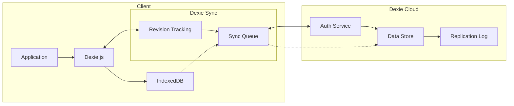
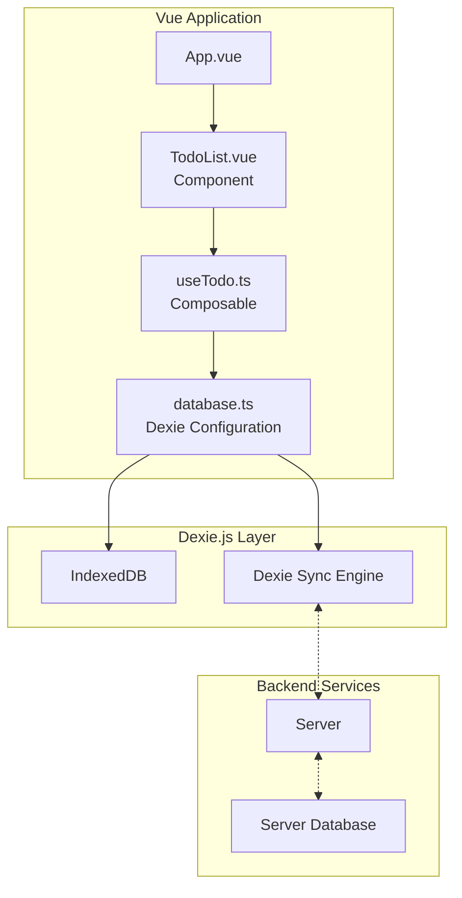

---
layout: intro
class: 'flex flex-col items-center justify-center text-center'
background: 'linear-gradient(180deg, #212733 0%, #1a1f2c 100%)'
---

<div class="mb-4 text-primary opacity-70 font-mono tracking-widest">
BUILDING BETTER WEB APPS
</div>

# What is Local-First Web Development <br> and How Can We Build It With Vue

<div class="flex items-center justify-center gap-4 mt-6">
  <div class="i-logos-vue text-4xl animate-pulse" />
  <div class="i-carbon-data-backup text-4xl text-primary animate-bounce-slow" />
  <div class="i-logos-pwa text-4xl animate-pulse" />
</div>

<div class="mt-8 text-lg opacity-70">
by Alexander Opalic
</div>

<style>
.animate-bounce-slow {
  animation: bounce 2s infinite;
}
</style>

---
layout: intro
glowSeed: 15
glowOpacity: 0.3
class: 'pl-30'
---

# Alexander Opalic

<div class="absolute top-20 right-30 flex flex-col items-center">
  
</div>

<div class="text-xl opacity-80 mb-4 flex items-center gap-2">
  <div class="opacity-50">Senior Full Stack Developer</div>
  <div>at</div>
  <div class="opacity-80">Otto Payments</div>
</div>

<div class="text-lg opacity-70 mb-8">
  7 years of development experience in the Munich Area
</div>

<div class="text-lg opacity-70 mb-8 text-primary font-bold">
  I write blog posts at alexop.dev - check them out!
</div>

<div class="flex flex-wrap gap-2 my-8">
  <div class="flex items-center gap-2">
    <div class="i-carbon-user text-2xl text-blue-400" /> alexop.dev
  </div>
  <div class="flex items-center gap-2">
    <div class="i-carbon-logo-github text-2xl text-purple-400" /> alexanderop
  </div>
  <div class="flex items-center gap-2">
    <div class="i-carbon-email text-2xl text-green-400" /> alex.opalic.dev@gmail.com
  </div>
  <div class="flex items-center gap-2">
    <div class="i-carbon-logo-twitter text-2xl text-blue-500" /> @alexanderopalic
  </div>
</div>

---
layout: center
class: 'text-center'
---

# The Current Way Apps Are Built

```mermaid
flowchart LR
    subgraph Client["Browser"]
        vue[Vue]
    end

    subgraph Cloud["Cloud"]
        api[Server]
        db[(Database)]
        api --> db
    end

    vue <--> api
    
    style Client fill:#2d1b36,stroke:#9c27b0
    style Cloud fill:#1a1a1a,stroke:#9c27b0
    
    classDef default fill:#2d1b36,stroke:#9c27b0,color:#ffffff
    classDef storage fill:#2d1b36,stroke:#9c27b0,color:#ffffff
    
    class db storage
```



---
layout: center
clicks: 4
---

# The Problems of the Current Way
<div class="opacity-80 mb-8">What could go wrong?</div>

<div class="grid grid-cols-2 gap-4 mt-8">
  <div class="p-6 border rounded-lg transform transition-all duration-500 hover:scale-105" v-click="1">
    <div class="flex items-center space-x-4">
      <div class="text-3xl">🔌</div>
      <div class="font-bold text-xl">Offline Limitations</div>
    </div>
    <p class="mt-4">Applications don't work without internet connection</p>
  </div>

  <div class="p-6 border rounded-lg transform transition-all duration-500 hover:scale-105" v-click="2">
    <div class="flex items-center space-x-4">
      <div class="text-3xl">🔒</div>
      <div class="font-bold text-xl">Data Control</div>
    </div>
    <p class="mt-4">User is not in control of their data</p>
  </div>

  <div class="p-6 border rounded-lg transform transition-all duration-500 hover:scale-105" v-click="3">
    <div class="flex items-center space-x-4">
      <div class="text-3xl">⚡️</div>
      <div class="font-bold text-xl">Performance</div>
    </div>
    <p class="mt-4">Can be slow due to network dependencies</p>
  </div>

  <div class="p-6 border rounded-lg transform transition-all duration-500 hover:scale-105" v-click="4">
    <div class="flex items-center space-x-4">
      <div class="text-3xl">🔧</div>
      <div class="font-bold text-xl">Complexity</div>
    </div>
    <p class="mt-4">Complicated to build and maintain</p>
  </div>
</div>

<style>
.slidev-vclick-target {
  transition: all 500ms ease;
}

.slidev-vclick-hidden {
  transform: translateY(20px);
  opacity: 0;
}
</style>

---
layout: quote
---

<div class="text-xl mt-12">
  <blockquote>
    In <span v-mark.underline.blue="1">local-first</span> software, "<span v-mark.underline.red="2">the availability of another computer</span> should never prevent you from working."
  </blockquote>
  
  <div class="text-right mt-4">
    — Martin Kleppmann
  </div>
</div>

---
layout: default
---

# Local-First Principles

<div class="grid grid-cols-3 gap-4 mt-4">
  <div class="p-4 border rounded-lg">
    <div class="font-bold text-lg mb-2">⚡️ 1. No Spinners</div>
    <div class="text-sm">Work at your fingertips, instant local operations</div>
  </div>

  <div class="p-4 border rounded-lg">
    <div class="font-bold text-lg mb-2">📱 2. Multi-Device</div>
    <div class="text-sm">Your work isn't trapped on one device</div>
  </div>

  <div class="p-4 border rounded-lg">
    <div class="font-bold text-lg mb-2">🔌 3. Network Optional</div>
    <div class="text-sm">Full functionality even when offline</div>
  </div>

  <div class="p-4 border rounded-lg">
    <div class="font-bold text-lg mb-2">👥 4. Collaboration</div>
    <div class="text-sm">Seamless real-time collaboration</div>
  </div>

  <div class="p-4 border rounded-lg">
    <div class="font-bold text-lg mb-2">⏳ 5. Long Now</div>
    <div class="text-sm">Data remains accessible for years to come</div>
  </div>

  <div class="p-4 border rounded-lg">
    <div class="font-bold text-lg mb-2">🔒 6. Privacy & Security</div>
    <div class="text-sm">Private and secure by default</div>
  </div>
</div>

<div class="mt-4">
  <div class="p-4 border rounded-lg">
    <div class="font-bold text-lg mb-2">🎮 7. User Control</div>
    <div class="text-sm">Retain ultimate ownership of your data</div>
  </div>
</div>

<div class="absolute bottom-4 right-4 text-sm opacity-50">
  Source: "Local-first software" by Martin Kleppmann et al.
</div>

---
layout: center
---

<div class="progress-track" :class="{ 'all-complete': $clicks === 3 }">
  <div class="progress-item" v-click="1">
    <div class="progress-line"></div>
    <div class="stage">PWA Ready</div>
    <div class="percentage">33%</div>
    <div class="description">Install PWA dependencies, configure manifest & service worker</div>
  </div>
  
  <div class="progress-item" v-click="2">
    <div class="progress-line"></div>
    <div class="stage">Storage Ready</div>
    <div class="percentage">66%</div>
    <div class="description">Implement client-side storage for reliable data persistence</div>
  </div>
  
  <div class="progress-item" v-click="3">
    <div class="progress-line"></div>
    <div class="stage">Local-First Ready</div>
    <div class="percentage">100%</div>
    <div class="description">Implement sync engine and offline-first functionality</div>
  </div>
</div>

<style>
.progress-track {
  position: relative;
  padding-left: 2rem;
  display: flex;
  flex-direction: column;
  gap: 8rem;
}

.progress-track::before {
  content: '';
  position: absolute;
  left: 0;
  top: 0;
  bottom: 0;
  width: 4px;
  background: rgba(255, 255, 255, 0.1);
  opacity: 1;
  transition: opacity 0.5s ease;
}

.progress-track.all-complete::before {
  opacity: 0;
}

.progress-item {
  display: flex;
  align-items: center;
  gap: 3rem;
  opacity: 0.5;
  transition: opacity 0.5s ease;
}

.progress-item.slidev-vclick-current {
  opacity: 1;
}

.progress-line {
  position: absolute;
  left: 0;
  width: 4px;
  height: 8rem;
  background: var(--slidev-theme-primary);
  transform: scaleY(0);
  transform-origin: top;
  transition: transform 0.5s ease;
}

.progress-item.slidev-vclick-current .progress-line,
.progress-item.slidev-vclick-prior .progress-line {
  transform: scaleY(1);
}

.stage {
  font-size: 2.5rem;
  font-weight: 500;
  min-width: 20rem;
}

.percentage {
  font-size: 2.5rem;
  font-weight: bold;
  color: var(--slidev-theme-primary);
}

.description {
  font-size: 1.2rem;
  opacity: 0.8;
  max-width: 25rem;
}

.slidev-vclick-hidden {
  transform: translateY(10px);
  opacity: 0;
}
</style>

---
layout: default
---

# Implementation Guides

<div class="text-lg opacity-80 mb-8">
  Want to dive deeper? Check out my detailed guides after the talk:
</div>

<div class="grid grid-cols-2 gap-8">
  <a href="https://alexop.dev/posts/create-pwa-vue3-vite-4-steps/" target="_blank" class="p-6 border rounded-lg hover:border-primary transition-colors">
    <div class="flex items-center space-x-4 mb-4">
      <div class="text-3xl">📖</div>
      <h3 class="text-xl font-bold">PWA Implementation</h3>
    </div>
    <p class="opacity-80">Complete guide to creating a PWA with Vue 3 + Vite</p>
  </a>

  <a href="https://alexop.dev/posts/sqlite-vue3-offline-first-web-apps-guide/" target="_blank" class="p-6 border rounded-lg hover:border-primary transition-colors">
    <div class="flex items-center space-x-4 mb-4">
      <div class="text-3xl">💾</div>
      <h3 class="text-xl font-bold">SQLite Integration</h3>
    </div>
    <p class="opacity-80">Step-by-step SQLite setup for offline-first apps</p>
  </a>
</div>

---
layout: center
---

# Dexie.js

<div class="mt-8 space-y-8">
  <div class="flex items-start space-x-6">
    <div class="p-4 border rounded-lg">
      <div class="text-3xl">🔧</div>
    </div>
    <div>
      <h3 class="text-xl font-bold">Enhanced IndexedDB Usage</h3>
      <div class="text-gray-600">Provides a friendly and intuitive way to work with IndexedDB</div>
    </div>
  </div>

  <div class="flex items-start space-x-6">
    <div class="p-4 border rounded-lg">
      <div class="text-3xl">☁️</div>
    </div>
    <div>
      <h3 class="text-xl font-bold">Built-in Cloud Solutions</h3>
      <div class="text-gray-600">Includes ready-to-use sync engine, authentication, and cloud storage options</div>
    </div>
  </div>

  <div class="flex items-start space-x-6">
    <div class="p-4 border rounded-lg">
      <div class="text-3xl">🔄</div>
    </div>
    <div>
      <h3 class="text-xl font-bold">Flexible Server Options</h3>
      <div class="text-gray-600">Freedom to use your own server infrastructure instead of their cloud services</div>
    </div>
  </div>
</div>

---
layout: center
---

# Understanding Dexie.js Architecture



---
layout: two-cols
---

# Setting Up Dexie Cloud

```bash
# 1. Create cloud database
npx dexie-cloud create

# 2. Whitelist your app origin
npx dexie-cloud whitelist http://localhost:3000

# 3. Install dependencies
npm install dexie@latest dexie-cloud-addon
```

::right::

<div class="ml-4 mt-12">
<div v-click="1">
- Creates your database in the cloud
- Requires email verification
- Stores URL in dexie-cloud.json
</div>

<div v-click="2" class="mt-4">
- Add your app's origin
- Required for security
- Can add multiple origins
</div>

<div v-click="3" class="mt-4">
- Latest Dexie version
- Cloud sync capabilities
- Free tier available
</div>
</div>

---
layout: center
---

# Setting Up Dexie.js with Cloud Sync

<div class="text-lg opacity-80 mb-8">Let's break down the implementation step by step</div>

---
layout: two-cols
---

# 1. Imports & Types

```ts {all|1-2|4-9}
import Dexie, { type Table } from 'dexie'
import dexieCloud from 'dexie-cloud-addon'

export interface Todo {
  id?: string
  title: string
  completed: boolean
  createdAt: Date
}
```

::right::

<div class="ml-4 mt-12">
<div v-click="1">
- Import Dexie core and types
- Add cloud sync capabilities
</div>

<div v-click="2" class="mt-8">
- Define Todo interface
- Properties for task management
- Unique ID for sync
</div>
</div>

---
layout: two-cols
---

# 2. Database Setup

```ts {all|1,2,4|6-10}
export class TodoDB extends Dexie {
  todos!: Table<Todo>

  constructor() {
    super('TodoDB', { addons: [dexieCloud] })
    
    this.version(1).stores({
      todos: '@id, title, completed, createdAt',
    })
  }
}
```

::right::

<div class="ml-4 mt-12">
<div v-click="1">
- Extend Dexie class
- Define todos table type
</div>

<div v-click="2" class="mt-4">
- Initialize with cloud addon
</div>

<div v-click="3" class="mt-4">
- Define schema version
- `@id` for cloud sync
- Index searchable fields
</div>
</div>

---
layout: two-cols
---

# 3. Cloud Configuration

```ts {all|1-7|9-10|12-16}
async configureSync(databaseUrl: string) {
  await this.cloud.configure({
    databaseUrl,
    requireAuth: true,
    tryUseServiceWorker: true,
  })
}

export const db = new TodoDB()
const url = import.meta.env.VITE_DEXIE_CLOUD_URL

if (!url) {
  throw new Error(
    'VITE_DEXIE_CLOUD_URL environment variable ' +
    'is not defined'
  )
}
```

::right::

<div class="ml-4 mt-12">
<div v-click="1">
- Configure cloud sync
- Enable authentication
- Use service worker for offline
</div>

<div v-click="2" class="mt-4">
- Create database instance
- Get cloud URL from env
</div>

<div v-click="3" class="mt-4">
- Validate configuration
- Fail fast if missing URL
</div>
</div>

---
layout: two-cols
---

# 4. Auth Exports

```ts {all}
db.configureSync(url).catch(console.error)

export const currentUser = db.cloud.currentUser
export const login = () => db.cloud.login()
export const logout = () => db.cloud.logout()
```

::right::

<div class="ml-4 mt-12">
<div v-click="1">
- Initialize cloud sync
- Export auth utilities:
  - Current user state
  - Login function
  - Logout function
</div>
</div>

---
layout: center
---

# Building a Todo App with Dexie.js



---
layout: center
---

# Building the Todo Composable

<div class="text-lg opacity-80 mb-8">Let's explore how to build reactive todo management with Vue</div>

---
layout: two-cols
---

# 1. Setup & Imports

```ts {all|1|2-3|4-5}
import { db, type Todo } from '@/db/todo'
import { useObservable } from '@vueuse/rxjs'
import { liveQuery } from 'dexie'
import { from } from 'rxjs'
import { computed, ref } from 'vue'

export function useTodos() {
  const newTodoTitle = ref('')
  const error = ref<string | null>(null)
}
```

::right::

<div class="ml-4 mt-12">
<div v-click="1">
- Import database and types
</div>

<div v-click="2" class="mt-4">
- RxJS integration for Vue
- Dexie live queries
</div>

<div v-click="3" class="mt-4">
- Vue Composition API
- Reactive state management
</div>
</div>

---
layout: two-cols
---

# 2. Reactive Queries

```ts {all|2-4|6-8|10-12}
export function useTodos() {
  const todos = useObservable<Todo[]>(
    from(liveQuery(() => db.todos.orderBy('createdAt').toArray())),
  )

  const completedTodos = computed(() =>
    todos.value?.filter(todo => todo.completed) ?? [],
  )

  const pendingTodos = computed(() =>
    todos.value?.filter(todo => !todo.completed) ?? [],
  )
}
```

::right::

<div class="ml-4 mt-12">
<div v-click="1">
- Live query for todos
- Auto-updates on changes
- Ordered by creation date
</div>

<div v-click="2" class="mt-4">
- Computed completed todos
- Filtered reactively
</div>

<div v-click="3" class="mt-4">
- Computed pending todos
- Automatic updates
</div>
</div>

---
layout: two-cols
---

# 3. Adding Todos

```ts {all|1-3|5-11|13-17}
export function useTodos() {
  const newTodoTitle = ref('')
  const error = ref<string | null>(null)

  const addTodo = async () => {
    try {
      if (!newTodoTitle.value.trim())
        return

      await db.todos.add({
        title: newTodoTitle.value,
        completed: false,
        createdAt: new Date(),
      })

      newTodoTitle.value = ''
      error.value = null
    }
    catch (err) {
      error.value = 'Failed to add todo'
    }
  }
}
```

::right::

<div class="ml-4 mt-12">
<div v-click="1">
- Reactive state for input
- Error handling state
</div>

<div v-click="2" class="mt-4">
- Validate input
- Add new todo to database
- Set initial properties
</div>

<div v-click="3" class="mt-4">
- Reset input
- Handle errors gracefully
</div>
</div>

---
layout: two-cols
---

# 4. Managing Todos

```ts {all|1-9|11-19}
const toggleTodo = async (todo: Todo) => {
  try {
    await db.todos.update(todo.id!, {
      completed: !todo.completed,
    })
    error.value = null
  }
  catch (err) {
    error.value = 'Failed to toggle todo'
  }
}

const deleteTodo = async (id: string) => {
  try {
    await db.todos.delete(id)
    error.value = null
  }
  catch (err) {
    error.value = 'Failed to delete todo'
  }
}
```

::right::

<div class="ml-4 mt-12">
<div v-click="1">
- Toggle completion status
- Update in database
- Error handling
</div>

<div v-click="2" class="mt-4">
- Delete todos by ID
- Clean error handling
- Automatic UI updates
</div>
</div>

---
layout: center
---

# Putting It All Together

```ts
return {
  todos,          // Live query of all todos
  newTodoTitle,   // Input binding
  error,          // Error state
  completedTodos, // Filtered completed
  pendingTodos,     // Filtered pending
  addTodo,         // Create new
  toggleTodo,      // Toggle status
  deleteTodo,      // Remove todo
}
```

<div class="mt-8 text-lg opacity-80">
A clean, reactive, and type-safe todo management system
</div>

---
layout: two-cols
---

# Using the Composable

```vue {all|2-3|5-12|14-27|29-39}
<script setup lang="ts">
import { useTodos } from '@/composables/useTodos'
import { onMounted } from 'vue'

const {
  todos,
  newTodoTitle,
  error,
  completedTodos,
  pendingTodos,
  addTodo,
  toggleTodo,
  deleteTodo,
} = useTodos()

const handleSubmit = async (e: Event) => {
  e.preventDefault()
  await addTodo()
}

const handleToggle = async (id: string) => {
  const todo = todos.value?.find(t => t.id === id)
  if (todo) {
    await toggleTodo(todo)
  }
}

const handleDelete = async (id: string) => {
  await deleteTodo(id)
}
</script>

<template>
  <form @submit="handleSubmit" class="mb-4">
    <input
      v-model="newTodoTitle"
      placeholder="Add new todo..."
      class="p-2 border rounded"
    />
    <button type="submit">Add</button>
  </form>

  <div v-if="error" class="text-red-500">{{ error }}</div>
</template>
```

::right::

<div class="ml-4 mt-12">
<div v-click="1">
- Import and setup composable
</div>

<div v-click="2" class="mt-4">
- Destructure needed functions
- Access reactive state
</div>

<div v-click="3" class="mt-4">
- Handle form submission
- Manage todo actions
- Error handling
</div>

<div v-click="4" class="mt-4">
- Create input form
- Display error messages
- Reactive data binding
</div>
</div>

<style>
.slidev-icon {
  display: inline-block;
  width: 1.2em;
  height: 1.2em;
}

[class*='i-'] {
  display: inline-block;
  width: 1.2em;
  height: 1.2em;
}
</style>

---
layout: center
---

# Local-First Software Fit Guide

| ✅ Good Fit | ❌ Bad Fit |
|------------|------------|
| 📝 **File Editing**<br>text editors, word processors, spreadsheets, slides, graphics, video, music, CAD | 💰 **Money**<br>banking, payments, ad tracking |
| 📋 **Productivity**<br>notes, tasks, issues, calendar, time tracking, messaging | 📦 **Physical Resources**<br>e-commerce, inventory |
| | 🚗 **Vehicles**<br>car sharing, freight, logistics |

---
layout: center
class: text-center
---

# Build Better Apps with Local-First Development
<div class="text-3xl text-primary font-bold mb-12">
Thank you for your attention!
</div>

<div class="grid grid-cols-1 gap-6 max-w-3xl mx-auto text-left">
  <a href="https://alexop.dev/posts/what-is-local-first-web-development/" target="_blank" class="p-6 border rounded-lg hover:border-primary transition-colors">
    <div class="flex items-center space-x-4 mb-4">
      <div class="text-3xl">📝</div>
      <h3 class="text-xl font-bold">Complete Guide to Local-First</h3>
    </div>
    <p class="opacity-80 mb-2">Deep dive into Local-First Web Development</p>
    <div class="text-sm text-primary">https://alexop.dev/posts/what-is-local-first-web-development/</div>
  </a>

  <a href="https://localfirstweb.dev/" target="_blank" class="p-6 border rounded-lg hover:border-primary transition-colors">
    <div class="flex items-center space-x-4 mb-4">
      <div class="text-3xl">🌐</div>
      <h3 class="text-xl font-bold">Local-First Web Community</h3>
    </div>
    <p class="opacity-80 mb-2">Join the community and explore more resources</p>
    <div class="text-sm text-primary">https://localfirstweb.dev/</div>
  </a>
</div>

<style>
a {
  text-decoration: none;
  color: inherit;
}
</style>
