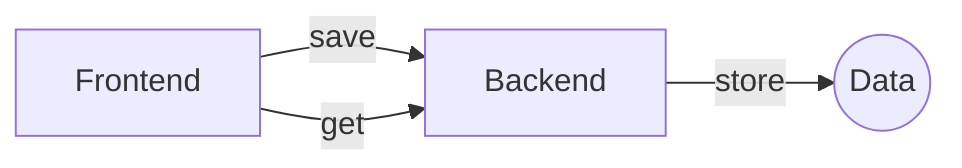
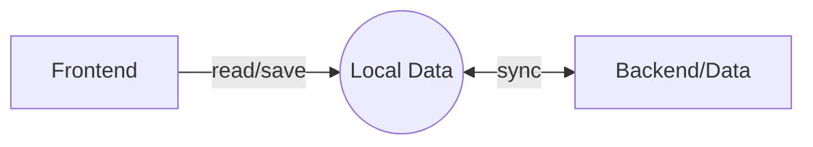

```mermaid{scale: 1.2}
---
title: Traditional Web Application
---
graph LR
    F[Frontend]:::client
    B[Backend]:::server
    D[(Database)]:::db
    
    F -->|HTTP POST| B
    F -->|HTTP GET| B
    B -->|CRUD Operations| D

    classDef client fill:#212733,stroke:#FF6BED,stroke-width:2px
    classDef server fill:#344060,stroke:#AB4B99,stroke-width:2px
    classDef db fill:#8A337B,stroke:#EAEDF3,stroke-width:2px
```

```mermaid{scale: 1.2}
---
title: Local first
---
graph LR
    F[Frontend]:::client
    L[(Local Data)]:::local
    B[Backend/Data]:::server
    
    F -->|read/save| L
    L <-->|sync| B

    classDef client fill:#212733,stroke:#FF6BED,stroke-width:2px
    classDef local fill:#344060,stroke:#AB4B99,stroke-width:2px
    classDef server fill:#8A337B,stroke:#EAEDF3,stroke-width:2px
```

```mermaid
flowchart TD
    subgraph VueApp["Vue Application"]
        App["App.vue"]
        TodoList["TodoList.vue<br>Component"]
        UseTodo["useTodo.ts<br>Composable"]
        Database["database.ts<br>Dexie Configuration"]
        
        App --> TodoList
        TodoList --> UseTodo
        UseTodo --> Database
    end
    
    subgraph DexieLayer["Dexie.js Layer"]
        IndexedDB["IndexedDB"]
        SyncEngine["Dexie Sync Engine"]
        
        Database --> IndexedDB
        Database --> SyncEngine
    end
    
    subgraph Backend["Backend Services"]
        Server["Server"]
        ServerDB["Server Database"]
        
        SyncEngine <-.-> Server
        Server <-.-> ServerDB
    end

    style VueApp fill:#2d1b36,stroke:#FF6BED
    style DexieLayer fill:#344060,stroke:#AB4B99
    style Backend fill:#1a1f2c,stroke:#8A337B
    
    classDef default fill:#8A337B,stroke:#AB4B99,color:#EAE9F3
    classDef storage fill:#1a1f2c,stroke:#AB4B99,color:#EAE9F3
    
    class Server,ServerDB storage
```

<VueNationLogo></VueNationLogo>

---
layout: intro
class: 'flex flex-col items-center justify-center text-center'
background: 'linear-gradient(180deg, #212733 0%, #1a1f2c 100%)'
---

<div class="mb-4 text-primary opacity-70 font-mono tracking-widest">
BUILDING BETTER WEB APPS
</div>

# What is Local-First Web Development <br> and How Can We Build It With Vue

<div class="flex items-center justify-center gap-4 mt-6">
  <div class="i-logos-vue text-4xl animate-pulse" />
  <div class="i-carbon-data-backup text-4xl text-primary animate-bounce-slow" />
  <div class="i-logos-pwa text-4xl animate-pulse" />
</div>

<div class="mt-8 text-lg opacity-70">
by Alexander Opalic
</div>

<style>
.animate-bounce-slow {
  animation: bounce 2s infinite;
}
</style>

---
layout: intro
glowSeed: 15
glowOpacity: 0.3
class: 'pl-30'
---

# Alexander Opalic

<div class="absolute top-20 right-30 flex flex-col items-center">
  
</div>

<div class="text-xl opacity-80 mb-4 flex items-center gap-2">
  <div class="opacity-50">Senior Full Stack Developer</div>
  <div>at</div>
  <div class="opacity-80">Otto Payments 🦞</div>
</div>

<div class="text-lg opacity-70 mb-8">
  7 years of development experience in the Munich Area
</div>

<div class="text-lg opacity-70 mb-8 text-primary font-bold">
  I write blog posts at alexop.dev - check them out!
</div>

<div class="flex flex-wrap gap-2 my-8">
  <ContactItem
    iconClass="i-carbon-user"
    text="alexop.dev"
    color="#60A5FA"
  />
  <ContactItem
    iconClass="i-carbon-logo-github"
    text="alexanderop"
    color="#A78BFA"
  />
  <ContactItem
    iconClass="i-carbon-email"
    text="alex.opalic.dev@gmail.com"
    color="#4ADE80"
  />
  <ContactItem
    iconClass="i-carbon-logo-x"
    text="@alexanderopalic"
    color="#3B82F6"
  />
</div>
---
---
# How do we currently build Apps?
---
layout: center
---



---
layout: center
---

# The Problems of the Current Way
<div class="opacity-80 mb-8">What could go wrong?</div>

<div class="grid grid-cols-2 gap-4 mt-8">
  <div v-click="1">
    <SlidingCard
      icon="🔌"
      title="Offline Limitations"
    >
      Applications don't work without internet connection
    </SlidingCard>
  </div>

  <div v-click="2">
    <SlidingCard
      icon="🔒"
      title="Data Control"
    >
      User is not in control of their data
    </SlidingCard>
  </div>

  <div v-click="3">
    <SlidingCard
      icon="⚡️"
      title="Performance"
    >
      Can be slow due to network dependencies
    </SlidingCard>
  </div>

  <div v-click="4">
    <SlidingCard
      icon="🔧"
      title="Complexity"
    >
      Complicated to build and maintain
    </SlidingCard>
  </div>
</div>

<style>
@keyframes slide-in {
  from {
    opacity: 0;
    transform: translateY(20px);
  }
  to {
    opacity: 1;
    transform: translateY(0);
  }
}

.animate-slide-in {
  animation: slide-in 0.6s ease-out forwards;
}
</style>

---
layout: quote
---

<QuoteCard author="Martin Kleppmann">
  In <span v-mark.underline.blue="1">local-first</span> software, "<span v-mark.underline.red="2">the availability of another computer</span> should never prevent you from working."
</QuoteCard>

---
layout: iframe-left
url: https://www.inkandswitch.com/local-first
---
# Local-First Principles

<ul class="space-y-4">
  <li v-click="1">
    <div class="flex items-center gap-2">
      <span class="text-xl">⚡️</span>
      <span class="font-bold">1. No Spinners:</span>
      Instant local operations
    </div>
  </li>

  <li v-click="2">
    <div class="flex items-center gap-2">
      <span class="text-xl">📱</span>
      <span class="font-bold">2. Multi-Device:</span>
      Access from any device
    </div>
  </li>

  <li v-click="3">
    <div class="flex items-center gap-2">
      <span class="text-xl">🔌</span>
      <span class="font-bold">3. Network Optional:</span>
      Works offline
    </div>
  </li>

  <li v-click="4">
    <div class="flex items-center gap-2">
      <span class="text-xl">👥</span>
      <span class="font-bold">4. Collaboration:</span>
      Real-time teamwork
    </div>
  </li>

  <li v-click="5">
    <div class="flex items-center gap-2">
      <span class="text-xl">⏳</span>
      <span class="font-bold">5. Long Now:</span>
      Long-term data access
    </div>
  </li>

  <li v-click="6">
    <div class="flex items-center gap-2">
      <span class="text-xl">🔒</span>
      <span class="font-bold">6. Privacy & Security:</span>
      Built-in protection
    </div>
  </li>

  <li v-click="7">
    <div class="flex items-center gap-2">
      <span class="text-xl">🎮</span>
      <span class="font-bold">7. User Control:</span>
      Full data ownership
    </div>
  </li>
</ul>

<div v-click="8" class="mt-8 text-sm opacity-70 flex items-center gap-2">
  <span class="i-carbon-link text-lg" />
  Source: <a href="https://www.inkandswitch.com/local-first/" target="_blank" class="text-primary hover:underline">inkandswitch.com/local-first</a>
</div>


---
layout: center
---



---
layout: center
class: 'text-center'
---

# Traditional vs Local-First Architecture

<div class="mb-4 text-xl opacity-70">From Complex to Simple</div>



<div class="my-8 text-xl opacity-70">To</div>


---
---

# How to do that with Vue?
---
layout: center
clicks: 3
---

<ProgressTracker
  :items="[
    {
      stage: 'PWA Ready',
      percentage: '33%',
      description: 'Install PWA dependencies, configure manifest & service worker',
      clickIndex: 1
    },
    {
      stage: 'Storage Ready',
      percentage: '66%',
      description: 'Implement client-side storage for reliable data persistence',
      clickIndex: 2
    },
    {
      stage: 'Local-First Ready',
      percentage: '100%',
      description: 'Implement sync engine and offline-first functionality',
      clickIndex: 3
    }
  ]"
  :is-complete="$clicks === 3"
/>

---
layout: default
---

# Implementation Guides

<div class="text-lg opacity-80 mb-8">
  Want to dive deeper? Check out my detailed guides after the talk:
</div>

<div class="grid grid-cols-2 gap-8">
  <GuideCard
    href="https://alexop.dev/posts/create-pwa-vue3-vite-4-steps/"
    icon="📖"
    title="PWA Implementation"
  >
    Complete guide to creating a PWA with Vue 3 + Vite
  </GuideCard>

  <GuideCard
    href="https://alexop.dev/posts/sqlite-vue3-offline-first-web-apps-guide/"
    icon="💾"
    title="SQLite Integration"
  >
    Step-by-step SQLite setup for offline-first apps
  </GuideCard>
</div>
---
---


```mermaid
---
title: Local-First Architecture with Central Server
---
flowchart LR
    subgraph client1[Client Device]
        UI1[UI]:::client --> DB1[Local Data]:::local
    end

    subgraph client2[Client Device]
        UI2[UI]:::client --> DB2[Local Data]:::local
    end

    subgraph server[Central Server]
        SDB[Server Data]:::server
        Sync[Sync Service]:::sync
    end

    DB1 <--> Sync
    DB2 <--> Sync
    Sync <--> SDB

    classDef client fill:#212733,stroke:#FF6BED,stroke-width:2px
    classDef local fill:#344060,stroke:#AB4B99,stroke-width:2px
    classDef server fill:#8A337B,stroke:#EAEDF3,stroke-width:2px
    classDef sync fill:#212733,stroke:#EAEDF3,stroke-width:2px
    
    style client1 fill:none,stroke:#FF6BED,stroke-width:2px
    style client2 fill:none,stroke:#FF6BED,stroke-width:2px
    style server fill:none,stroke:#AB4B99,stroke-width:2px
```

Key decisions:
- How much data to store locally (full vs. partial dataset)
- How to handle multi-user conflict resolution

---
layout: image
image: /images/linear.png
backgroundSize: contain
---
---
layout: iframe-left
url: https://dexie.org/
---

# Dexie.js

<div class="mt-8 space-y-8">
  <div v-click="1">
    <FeatureCard
      icon="🔧"
      title="Enhanced IndexedDB Usage"
    >
      Provides a friendly and intuitive way to work with IndexedDB
    </FeatureCard>
  </div>

  <div v-click="2">
    <FeatureCard
      icon="☁️"
      title="Built-in Cloud Solutions"
    >
      Includes ready-to-use sync engine, authentication, and cloud storage options
    </FeatureCard>
  </div>

  <div v-click="3">
    <FeatureCard
      icon="🔄"
      title="Flexible Server Options"
    >
      Freedom to use your own server infrastructure instead of their cloud services
    </FeatureCard>
  </div>
</div>

---
layout: image-left
image: /images/todoApp.png
backgroundSize: contain
---


<div class="text-lg opacity-80 flex items-center justify-center h-full">Setting Up Dexie.js with Cloud Sync</div>

---
layout: center
---

# Project Structure

```bash {all|1-5|6-7|8-9|10-11|12}
src/
├── components/
│   ├── Ui/           # UI components using shadcn
│   ├── TodoList.vue  # Todo list component
│   └── AuthGuard.vue # Auth wrapper component
├── composables/
│   └── useTodos.ts   # Todo management logic
├── pages/
│   └── index.vue     # Main page with TodoList
└── db/
    └── todo.ts       # Dexie configuration
├── App.vue           # Is using AuthGuard.vue
```

<div class="mt-8">
<div v-click="1">
1. Components handle the UI and user interactions with shadcn integration
</div>

<div v-click="2">
2. Composables contain reusable business logic for todo management
</div>

<div v-click="3">
3. Main page combines AuthGuard for authentication and TodoList for task management
</div>

<div v-click="4">
4. Database setup and configuration for Dexie.js
</div>
<div v-click="5">
5. App.vue will use AuthGuard to make routes save
</div>
</div>
---
---

---
layout: two-cols
class: 'gap-12 px-4'
cols: '2fr 3fr'
---

# Cloud Setup Steps

<div class="space-y-8">

## 1. Create Database
```bash
npx dexie-cloud create
```

## 2. Whitelist Origins
```bash
npx dexie-cloud whitelist http://localhost:3000
```

## 3. Install Dependencies
```bash
npm install dexie@latest dexie-cloud-addon
```

</div>

::right::

# Database Configuration

```ts {all|1-2|4-6|8-19|21-25}
import Dexie from "dexie";
import dexieCloud from "dexie-cloud-addon";

const db = new Dexie('MySyncedDB', {
  addons: [dexieCloud]
});

db.version(1).stores({
  // Local-only table with auto-increment
  localTodos: '++id, title, completed','created', 

  // Cloud-synced table with global ID
  cloudTodos: '@id, title, completed', 'created',

  /* 
   * '++id' = Local auto-increment (1, 2, 3...)
   * '@id'  = Global UUID for sync (e.g. "7f8d3a...")
   */
});

db.cloud.configure({
  databaseUrl: "https://<yourdatabase>.dexie.cloud",
  requireAuth: true // Optional: Block DB until authenticated
});
```

<style>
.slidev-code {
  @apply text-sm leading-6 px-4 py-3;
}

h1 {
  @apply mb-6 text-2xl;
}

h2 {
  @apply text-xl mb-2 text-primary;
}
</style>

---
layout: two-cols
class: 'gap-12'
---

# How to use liveQuery?

<div class="space-y-4">
  <div v-click="1">
    <h3 class="text-xl text-primary mb-2">🔄 Reactive Data Streams</h3>
    <p class="opacity-80">Perfect for handling real-time data and complex state changes</p>
  </div>

  <div v-click="2">
    <h3 class="text-xl text-primary mb-2">🔗 Bridge to IndexedDB</h3>
    <p class="opacity-80">Seamlessly connect Dexie's live queries with Vue's reactivity</p>
  </div>

  <div v-click="3">
    <h3 class="text-xl text-primary mb-2">⚡️ VueUse Integration</h3>
    <p class="opacity-80">useObservable composable makes RxJS feel native to Vue</p>
  </div>
</div>

::right::

```ts {all|2-3|5-8|9-15|all}
// Without VueUse
const todos$ = from(liveQuery(() => 
  db.todos.toArray()))

// Manual subscription
todos$.subscribe(todos => {
  // Update local state
  this.todos = todos
})

// With VueUse - clean & reactive!
import { useObservable } from '@vueuse/rxjs'
const todos = useObservable(
  from(liveQuery(() => 
    db.todos.toArray()))
)
```

<style>
.slidev-code {
  @apply text-sm leading-6 px-4 py-3 mt-4;
}
</style>

---
layout: center
---

````md magic-move
```ts
// 1. First, let's set up our basic imports and state
import { db, type Todo } from '@/db/todo'
import { ref } from 'vue'

export function useTodos() {
  const newTodoTitle = ref('')
  const error = ref<string | null>(null)
  
  return {
    newTodoTitle,
    error,
  }
}
```

```ts
// 2. Add reactive todos using RxJS and Dexie
import { db, type Todo } from '@/db/todo'
import { useObservable } from '@vueuse/rxjs'
import { liveQuery } from 'dexie'
import { from } from 'rxjs'
import { ref } from 'vue'

export function useTodos() {
  const newTodoTitle = ref('')
  const error = ref<string | null>(null)
  
  const todos = useObservable<Todo[]>(
    from(liveQuery(() => db.todos.orderBy('createdAt').toArray())),
  )
  
  return {
    todos,
    newTodoTitle,
    error,
  }
}
```

```ts
// 3. Add computed properties for filtered todos
import { db, type Todo } from '@/db/todo'
import { useObservable } from '@vueuse/rxjs'
import { liveQuery } from 'dexie'
import { from } from 'rxjs'
import { computed, ref } from 'vue'

export function useTodos() {
  const newTodoTitle = ref('')
  const error = ref<string | null>(null)
  
  const todos = useObservable<Todo[]>(
    from(liveQuery(() => db.todos.orderBy('createdAt').toArray())),
  )
  
  const completedTodos = computed(() =>
    todos.value?.filter(todo => todo.completed) ?? [],
  )
  const pendingTodos = computed(() =>
    todos.value?.filter(todo => !todo.completed) ?? [],
  )
  
  return {
    todos,
    newTodoTitle,
    error,
    completedTodos,
    pendingTodos,
  }
}
```

```ts
// 4. Add the addTodo function
export function useTodos() {
  // ... previous code ...
  const addTodo = async () => {
    try {
      if (!newTodoTitle.value.trim())
        return
      await db.todos.add({
        title: newTodoTitle.value,
        completed: false,
        createdAt: new Date(),
      })
      newTodoTitle.value = ''
      error.value = null
    }
    catch (err) {
      error.value = 'Failed to add todo'
      console.error(err)
    }
  }
  
  return {
    todos,
    newTodoTitle,
    error,
    completedTodos,
    pendingTodos,
    addTodo,
  }
}
```

```ts
// 5. Add toggle and delete functionality
export function useTodos() {
  // ... previous code ...
  const toggleTodo = async (todo: Todo) => {
    try {
      await db.todos.update(todo.id!, {
        completed: !todo.completed,
      })
      error.value = null
    }
    catch (err) {
      error.value = 'Failed to toggle todo'
      console.error(err)
    }
  }

  const deleteTodo = async (id: string) => {
    try {
      await db.todos.delete(id)
      error.value = null
    }
    catch (err) {
      error.value = 'Failed to delete todo'
      console.error(err)
    }
  }
  
  return
}
```
```ts
// can than be used like
const {
  newTodoTitle,
  completedTodos,
  pendingTodos,
  addTodo,
  toggleTodo,
  deleteTodo,
} = useTodos()
```
````
---
---

````md magic-move
```vue
<script setup lang="ts">
import { Button } from '@/components/ui/button'
import { Card, CardContent, CardDescription, CardFooter, CardHeader, CardTitle } from '@/components/ui/card'
import { currentUser, login, logout } from '@/db/todo'
import { Icon } from '@iconify/vue'
import { useObservable } from '@vueuse/rxjs'
import { computed, ref } from 'vue'
```

```vue
<script setup lang="ts">
import { Button } from '@/components/ui/button'
import { Card, CardContent, CardDescription, CardFooter, CardHeader, CardTitle } from '@/components/ui/card'
import { currentUser, login, logout } from '@/db/todo'
import { Icon } from '@iconify/vue'
import { useObservable } from '@vueuse/rxjs'
import { computed, ref } from 'vue'

const user = useObservable(currentUser)
const isAuthenticated = computed(() => !!user.value)
const isLoading = ref(false)

async function handleLogin() {
  isLoading.value = true
  try {
    await login()
  }
  finally {
    isLoading.value = false
  }
}
</script>
```

```vue
<script setup lang="ts">
const user = useObservable(currentUser)
const isAuthenticated = computed(() => !!user.value)
const isLoading = ref(false)

async function handleLogin() {
  isLoading.value = true
  try {
    await login()
  }
  finally {
    isLoading.value = false
  }
}
</script>

<template>
  <div v-if="!isAuthenticated" class="flex flex-col items-center justify-center min-h-screen p-4 bg-background">
    <Card class="max-w-md w-full">
      <!-- Login form content -->
    </Card>
  </div>
  <template v-else>
    <div class="sticky top-0 z-20 bg-card border-b">
      <!-- User info and logout button -->
    </div>
    <slot />
  </template>
</template>
```
```vue
<script setup lang="ts">
import AuthGuard from '@/components/AuthGuard.vue'
</script>

<template>
  <AuthGuard>
    <div class="min-h-screen bg-background text-foreground">
      <div class="safe-area-top bg-background" />
      <RouterView />
      <div class="safe-area-bottom bg-background" />
    </div>
  </AuthGuard>
</template>
```
````

---
---
# 🔗 Learn More

<div class="grid grid-cols-2 gap-4">

<div class="p-4 border rounded hover:shadow-lg transition-shadow">

## 📦 Source Code
[github.com/alexanderop/vue-dexie](https://github.com/alexanderop/vue-dexie)

</div>

<div class="p-4 border rounded hover:shadow-lg transition-shadow">

## 📝 Blog Post
[Building Local-First Apps with Vue & Dexie](https://alexop.dev/posts/building-local-first-apps-vue-dexie/)

</div>

</div>

---
---
# When to Use Local-First? 🤔

<div class="grid grid-cols-2 gap-4">

<div class="p-4 bg-green-50 dark:bg-green-900/20 rounded-lg border border-green-200 dark:border-green-800">

### Great For ✅
- Personal docs & notes 📝
- Creative tools & media 🎨
- Individual data tracking 👤
- Offline-first apps 📱

</div>

<div class="p-4 bg-red-50 dark:bg-red-900/20 rounded-lg border border-red-200 dark:border-red-800">

### Avoid For ❌
- Financial systems 💰
- E-commerce & inventory 📦
- Real-time operations 🌐
- Mission-critical apps ⚠️

</div>

</div>

---
---
# Thank You! 🙏

<div class="text-center">

## Let's Connect!

<div class="flex flex-col items-center gap-4 mt-8">
  <div class="flex items-center gap-2">
    <carbon:globe class="text-2xl" />
    <a href="https://alexop.dev" class="hover:text-primary transition-colors">alexop.dev</a>
  </div>
  
  <div class="flex items-center gap-2">
    <carbon:logo-x class="text-2xl" />
    <a href="https://twitter.com/alexanderop" class="hover:text-primary transition-colors">@alexanderopalic</a>
  </div>
</div>

<div class="mt-12 p-4 bg-card rounded-lg">
  <h3 class="text-xl font-bold mb-2">Want to Learn More?</h3>
  <p class="mb-4">Explore the world of local-first development:</p>
  <a href="https://localfirstweb.dev" class="inline-flex items-center gap-2 text-primary hover:underline">
    <carbon:arrow-right />
    localfirstweb.dev
  </a>
</div>

</div>
