```mermaid
flowchart LR
    subgraph Client["Browser"]
        vue[Vue]
    end

    subgraph Cloud["Cloud"]
        api[Server]
        db[(Database)]
        api --> db
    end

    vue <--> api
    
    style Client fill:#2d1b36,stroke:#9c27b0
    style Cloud fill:#1a1a1a,stroke:#9c27b0
    
    classDef default fill:#2d1b36,stroke:#9c27b0,color:#ffffff
    classDef storage fill:#2d1b36,stroke:#9c27b0,color:#ffffff
    
    class db storage
```

```mermaid
flowchart TD
    subgraph Browser["Browser"]
        UI["Vue Components"]
        dexie["Dexie.js"]
        db[(IndexedDB)]
        UI <--> |"Live Queries"| dexie
        dexie <--> |"CRUD Operations"| db
    end

    subgraph Cloud["Cloud (Optional)"]
        sync["Dexie Cloud Sync"]
        server["Server"]
        db2[(Remote DB)]
        sync <--> server
        server <--> db2
    end

    dexie <-.-> |"Background Sync"| sync

    style Browser fill:#2d1b36,stroke:#9c27b0
    style Cloud fill:#1a1a1a,stroke:#9c27b0
    
    classDef default fill:#2d1b36,stroke:#9c27b0,color:#ffffff
    classDef storage fill:#2d1b36,stroke:#9c27b0,color:#ffffff
```

# What is Local-First Web Development and How Can We Build It With Vue

---
layout: center
---

# Motivation

<div class="mt-8 space-y-8">
  <div class="flex items-start space-x-6" v-click>
    <div class="p-4 border rounded-lg">
      <div class="text-3xl">💡</div>
    </div>
    <div>
      <h3 class="text-xl font-bold">Personal Apps Journey</h3>
      <p class="text-gray-600">Last year, I wanted to build my own weight tracker and todo apps</p>
    </div>
  </div>
  <div class="flex items-start space-x-6" v-click>
    <div class="p-4 border rounded-lg">
      <div class="text-3xl">🔍</div>
    </div>
    <div>
      <h3 class="text-xl font-bold">Vue Investigation</h3>
      <p class="text-gray-600">Started exploring how to build these apps with Vue.js</p>
    </div>
  </div>
  <div class="flex items-start space-x-6" v-click>
    <div class="p-4 border rounded-lg">
      <div class="text-3xl">🎯</div>
    </div>
    <div>
      <h3 class="text-xl font-bold">Key Requirements</h3>
      <p class="text-gray-600">Needed apps that work offline, give me control of my data, and don't depend on external services</p>
    </div>
  </div>
</div>

---
layout: center
---

# The current way Apps are build



---
layout: center
---

# The Problems of the current way

<div class="grid grid-cols-2 gap-4 mt-8">
  <div v-click class="p-6 border rounded-lg">
    <div class="flex items-center space-x-4">
      <div class="text-3xl">🔌</div>
      <div class="font-bold text-xl">Offline Limitations</div>
    </div>
    <p class="mt-4">Applications don't work without internet connection</p>
  </div>

  <div v-click class="p-6 border rounded-lg">
    <div class="flex items-center space-x-4">
      <div class="text-3xl">🔒</div>
      <div class="font-bold text-xl">Data Control</div>
    </div>
    <p class="mt-4">User is not in control of their data</p>
  </div>

  <div v-click class="p-6 border rounded-lg">
    <div class="flex items-center space-x-4">
      <div class="text-3xl">⚡️</div>
      <div class="font-bold text-xl">Performance</div>
    </div>
    <p class="mt-4">Can be slow due to network dependencies</p>
  </div>

  <div v-click class="p-6 border rounded-lg">
    <div class="flex items-center space-x-4">
      <div class="text-3xl">🔧</div>
      <div class="font-bold text-xl">Complexity</div>
    </div>
    <p class="mt-4">Complicated to build and maintain</p>
  </div>
</div>

---
layout: quote
---

<div class="text-xl mt-12">
  <blockquote>
    In <span v-mark.underline.blue="1">local-first</span> software, "<span v-mark.underline.red="2">the availability of another computer</span> should never prevent you from working."
  </blockquote>
  
  <div class="text-right mt-4">
    — Martin Kleppmann
  </div>
</div>

---
layout: default
---

# Local-First Principles

<div class="grid grid-cols-3 gap-4 mt-4">
  <div v-click class="p-4 border rounded-lg">
    <div class="font-bold text-lg mb-2">⚡️ 1. No Spinners</div>
    <div class="text-sm">Work at your fingertips, instant local operations</div>
  </div>

  <div v-click class="p-4 border rounded-lg">
    <div class="font-bold text-lg mb-2">📱 2. Multi-Device</div>
    <div class="text-sm">Your work isn't trapped on one device</div>
  </div>

  <div v-click class="p-4 border rounded-lg">
    <div class="font-bold text-lg mb-2">🔌 3. Network Optional</div>
    <div class="text-sm">Full functionality even when offline</div>
  </div>

  <div v-click class="p-4 border rounded-lg">
    <div class="font-bold text-lg mb-2">👥 4. Collaboration</div>
    <div class="text-sm">Seamless real-time collaboration</div>
  </div>

  <div v-click class="p-4 border rounded-lg">
    <div class="font-bold text-lg mb-2">⏳ 5. Long Now</div>
    <div class="text-sm">Data remains accessible for years to come</div>
  </div>

  <div v-click class="p-4 border rounded-lg">
    <div class="font-bold text-lg mb-2">🔒 6. Privacy & Security</div>
    <div class="text-sm">Private and secure by default</div>
  </div>
</div>

<div class="mt-4">
  <div v-click class="p-4 border rounded-lg">
    <div class="font-bold text-lg mb-2">🎮 7. User Control</div>
    <div class="text-sm">Retain ultimate ownership of your data</div>
  </div>
</div>

<div class="absolute bottom-4 right-4 text-sm opacity-50">
  Source: "Local-first software" by Martin Kleppmann et al.
</div>

---
layout: default
---

# How to do it with Vue

<div class="mt-8 space-y-8">
  <div v-click class="p-6 border rounded-lg flex items-start space-x-6">
    <div class="text-3xl">🚀</div>
    <div>
      <h3 class="text-xl font-bold">Transform Your Vue SPA into a PWA</h3>
      <p class="text-gray-600">Enhance your app with service workers and offline capabilities</p>
    </div>
  </div>

  <div v-click class="p-6 border rounded-lg flex items-start space-x-6">
    <div class="text-3xl">💾</div>
    <div>
      <h3 class="text-xl font-bold">Implement Robust Storage Solutions</h3>
      <p class="text-gray-600">Utilize IndexedDB and other local storage mechanisms</p>
    </div>
  </div>

  <div v-click class="p-6 border rounded-lg flex items-start space-x-6">
    <div class="text-3xl">🔄</div>
    <div>
      <h3 class="text-xl font-bold">Develop Syncing and Authentication Systems</h3>
      <p class="text-gray-600">Create reliable data synchronization and secure user authentication</p>
    </div>
  </div>
</div>

---
layout: default
---

# Implementation Guides

<div class="grid grid-cols-2 gap-8 mt-8">
  <div v-click class="p-6 border rounded-lg">
    <div class="flex items-center space-x-4 mb-4">
      <div class="text-3xl">📖</div>
      <h3 class="text-xl font-bold">PWA Guide</h3>
    </div>
    <p class="text-gray-600">Follow the complete tutorial at: <a href="https://alexop.dev/posts/create-pwa-vue3-vite-4-steps/" target="_blank">Create PWA with Vue 3 + Vite in 4 Steps</a></p>
  </div>

  <div v-click class="p-6 border rounded-lg">
    <div class="flex items-center space-x-4 mb-4">
      <div class="text-3xl">💾</div>
      <h3 class="text-xl font-bold">SQLite Guide</h3>
    </div>
    <p class="text-gray-600">Learn how to implement SQLite in Vue 3 at: <a href="https://alexop.dev/posts/sqlite-vue3-offline-first-web-apps-guide/" target="_blank">SQLite + Vue 3 Offline-First Web Apps Guide</a></p>
  </div>
</div>
---
layout: center
---
# Dexie.js

<div class="mt-8 space-y-8">
  <div class="flex items-start space-x-6" v-click>
    <div class="p-4 border rounded-lg">
      <div class="text-3xl">🔧</div>
    </div>
    <div>
      <h3 class="text-xl font-bold">Enhanced IndexedDB Usage</h3>
      <p class="text-gray-600">Provides a friendly and intuitive way to work with IndexedDB</p>
    </div>
  </div>

  <div class="flex items-start space-x-6" v-click>
    <div class="p-4 border rounded-lg">
      <div class="text-3xl">☁️</div>
    </div>
    <div>
      <h3 class="text-xl font-bold">Built-in Cloud Solutions</h3>
      <p class="text-gray-600">Includes ready-to-use sync engine, authentication, and cloud storage options</p>
    </div>
  </div>

  <div class="flex items-start space-x-6" v-click>
    <div class="p-4 border rounded-lg">
      <div class="text-3xl">🔄</div>
    </div>
    <div>
      <h3 class="text-xl font-bold">Flexible Server Options</h3>
      <p class="text-gray-600">Freedom to use your own server infrastructure instead of their cloud services</p>
    </div>
  </div>
</div>
---
layout: default
---

# Project Structure Explained

<div class="mt-8 mb-6 p-6 border rounded-lg font-mono text-sm">
```plaintext
project/
├── src/
│   ├── components/
│   │   ├── TodoList.vue    # Main todo list component
│   │   └── TodoItem.vue    # Individual todo component
│   │   
│   ├── db/
│   │   ├── index.ts        # Dexie setup & cloud sync
│   │   └── types.ts        # TypeScript interfaces
│   │   
│   ├── stores/
│   │   └── todo.ts         # Pinia store
│   │   
│   ├── App.vue            
│   └── main.ts            
├── public/
│   ├── manifest.json       # PWA configuration
│   └── sw.js              # Service worker
└── .env                   # Environment variables
```
</div>
---
layout: center
---

---
---

````md magic-move
```ts
// Step 1: Import dependencies
import Dexie, { type Table } from 'dexie'
import dexieCloud from 'dexie-cloud-addon'
```

```ts {4-9}
// Step 2: Define the Todo interface
import Dexie, { type Table } from 'dexie'
import dexieCloud from 'dexie-cloud-addon'
export interface Todo {
  id?: string
  title: string
  completed: boolean
  createdAt: Date
}
```

```ts {10-18}
// Step 3: Create the database class
import Dexie, { type Table } from 'dexie'
import dexieCloud from 'dexie-cloud-addon'
export interface Todo {
  id?: string
  title: string
  completed: boolean
  createdAt: Date
}
export class TodoDB extends Dexie {
  todos!: Table<Todo>
  constructor() {
    super('TodoDB', { addons: [dexieCloud] })
    this.version(1).stores({
      todos: '@id, title, completed, createdAt',
    })
  }
}
```

```ts {18-24}
// Step 4: Add cloud sync configuration
import Dexie, { type Table } from 'dexie'
import dexieCloud from 'dexie-cloud-addon'
export interface Todo {
  id?: string
  title: string
  completed: boolean
  createdAt: Date
}
export class TodoDB extends Dexie {
  todos!: Table<Todo>
  constructor() {
    super('TodoDB', { addons: [dexieCloud] })
    this.version(1).stores({
      todos: '@id, title, completed, createdAt',
    })
  }
  async configureSync(databaseUrl: string) {
    await this.cloud.configure({
      databaseUrl,
      requireAuth: true,
      tryUseServiceWorker: true,
    })
  }
}
export const db = new TodoDB()
```

```ts  {18-30}
// Final Step: Initialize sync and export utilities
export class TodoDB extends Dexie {
  todos!: Table<Todo>
  constructor() {
    super('TodoDB', { addons: [dexieCloud] })
    this.version(1).stores({
      todos: '@id, title, completed, createdAt',
    })
  }
  async configureSync(databaseUrl: string) {
    await this.cloud.configure({
      databaseUrl,
      requireAuth: true,
      tryUseServiceWorker: true,
    })
  }
}
export const db = new TodoDB()
if (!import.meta.env.VITE_DEXIE_CLOUD_URL) {
  throw new Error('VITE_DEXIE_CLOUD_URL environment variable is not defined')
}
db.configureSync(import.meta.env.VITE_DEXIE_CLOUD_URL).catch((err) => {
  console.error('Failed to configure cloud sync:', err)
  if (err.name === 'NetworkError') {
    console.error('Network error - please check your connection')
  }
})
export const currentUser = db.cloud.currentUser
export const login = () => db.cloud.login()
export const logout = () => db.cloud.logout()
```
````

---
---

# CRUD Operations

````md magic-move
```ts
// 1. Add todo
const addTodo = async () => {
  await db.todos.add({
    title: newTodoTitle.value,
    completed: false,
    createdAt: new Date(),
  })
}
```

```ts
// 2. Toggle todo status
const addTodo = async () => {
  await db.todos.add({
    title: newTodoTitle.value,
    completed: false,
    createdAt: new Date(),
  })
}

const toggleTodo = async (todo: Todo) => {
  await db.todos.update(todo.id!, {
    completed: !todo.completed,
  })
}
```

```ts
// 3. Complete CRUD operations
const addTodo = async () => {
  await db.todos.add({
    title: newTodoTitle.value,
    completed: false,
    createdAt: new Date(),
  })
}

const toggleTodo = async (todo: Todo) => {
  await db.todos.update(todo.id!, {
    completed: !todo.completed,
  })
}

const deleteTodo = async (id: string) => {
  await db.todos.delete(id)
}
```
````
---
layout: default
---

# Practical Show Cases

<div class="mt-8 space-y-8">
  <div v-click class="p-6 border rounded-lg flex items-start space-x-6">
    <div class="text-3xl">⚡️</div>
    <div>
      <h3 class="text-xl font-bold">Speed-First Email</h3>
      <p class="text-gray-600">Why Superhuman is built for speed: applying the 100ms rule to email</p>
    </div>
  </div>

  <div v-click class="p-6 border rounded-lg flex items-start space-x-6">
    <div class="text-3xl">🎨</div>
    <div>
      <h3 class="text-xl font-bold">Multiplayer Design</h3>
      <p class="text-gray-600">How Figma's multiplayer technology works</p>
    </div>
  </div>

  <div v-click class="p-6 border rounded-lg flex items-start space-x-6">
    <div class="text-3xl">🔄</div>
    <div>
      <h3 class="text-xl font-bold">Sync at Scale</h3>
      <p class="text-gray-600">Scaling the Linear Sync Engine</p>
    </div>
  </div>
</div>
