```mermaid{scale: 0.8}
---
title: Tractor Store Micro Frontend Architecture
---
graph TB
    subgraph host["Host App (Rspack)"]
        Router["Router & Shell"]:::host
    end
    
    subgraph explore["Explore MF (Rspack)"]
        ExploreApp["Product Discovery<br>localhost:3004"]:::explore
    end
    
    subgraph decide["Decide MF (Vite)"]
        DecideApp["Product Details<br>localhost:5175"]:::decide
    end
    
    subgraph checkout["Checkout MF (Rspack)"]
        CheckoutApp["Cart & Orders<br>localhost:3003"]:::checkout
    end
    
    Router -.->|"mf:navigate events"| ExploreApp
    Router -.->|"remote loading"| DecideApp
    Router -.->|"cart sync"| CheckoutApp
    
    ExploreApp -.->|"add-to-cart"| CheckoutApp
    DecideApp -.->|"add-to-cart"| CheckoutApp
    CheckoutApp -.->|"updated-cart"| ExploreApp
    
    classDef host fill:#FF6BED,stroke:#AB4B99,stroke-width:2px,color:#000
    classDef explore fill:#344060,stroke:#AB4B99,stroke-width:2px
    classDef decide fill:#8A337B,stroke:#EAEDF3,stroke-width:2px
    classDef checkout fill:#212733,stroke:#FF6BED,stroke-width:2px
```

---
layout: center
class: 'text-center'
---

<ChapterCard 
  chapterNumber="Chapter 1" 
  title="Introduction"
  subtitle="Setting the stage"
/>

---
layout: image
image: images/howToStructure.png
backgroundSize: contain
---

---
layout: image
image: images/reddit.png
backgroundSize: contain
---

---
layout: image
image: images/chatgpt.png
backgroundSize: contain
---

---
layout: intro
glowSeed: 15
glowOpacity: 0.3
class: 'pl-30'
---


# Alexander Opalic

<div class="absolute top-20 right-30 flex flex-col items-center">
  
</div>

<div class="text-xl opacity-80 mb-4 flex items-center gap-2">
  <div class="opacity-50">Senior Full Stack Developer</div>
  <div>at</div>
  <div class="opacity-80">Otto Payments 🦞</div>
</div>

<div class="text-lg opacity-70 mb-8">
  7 years of development experience in the Munich Area
</div>

<div class="text-lg opacity-70 mb-8 text-primary font-bold">
  I write blog posts at alexop.dev - check them out!
</div>

<div class="flex flex-wrap gap-2 my-8">
  <ContactItem
    iconClass="i-carbon-user"
    text="alexop.dev"
    color="#60A5FA"
  />
  <ContactItem
    iconClass="i-carbon-logo-github"
    text="alexanderop"
    color="#A78BFA"
  />
  <ContactItem
    iconClass="i-carbon-email"
    text="alex.opalic.dev@gmail.com"
    color="#4ADE80"
  />
  <ContactItem
    iconClass="i-carbon-logo-x"
    text="@alexanderopalic"
    color="#3B82F6"
  />
</div>
---
layout: center
class: 'text-center'
---

<ChapterCard 
  chapterNumber="Chapter 2" 
  title="Why Structure Matters"
  subtitle="Conway's Law and team dynamics"
/>

---
layout: quote
class: 'text-center'
---

<QuoteCard author="Mel Conway">
  "Organizations which design systems are constrained to produce designs which are <span v-mark.underline.red="1">copies of the communication structures</span> of these organizations."
</QuoteCard>

<div v-click="2" class="mt-8 text-lg opacity-70">
  Known as <span class="text-primary font-bold">Conway's Law</span>
</div>


---
layout: image
image: images/largeColocated.png
backgroundSize: contain
---

---
layout: image
image: images/smallTeams.png
backgroundSize: contain
---

---
layout: center
---

# How to Choose?

<div class="grid grid-cols-3 gap-8 mt-8">
  <div v-click="1" class="text-center">
    <div class="text-6xl mb-4">👤</div>
    <div class="font-bold text-xl mb-2">Team Size</div>
    <div class="opacity-70">Solo → Enterprise</div>
  </div>
  
  <div v-click="2" class="text-center">
    <div class="text-6xl mb-4">🎯</div>
    <div class="font-bold text-xl mb-2">Complexity</div>
    <div class="opacity-70">Simple → Advanced</div>
  </div>
  
  <div v-click="3" class="text-center">
    <div class="text-6xl mb-4">⏱️</div>
    <div class="font-bold text-xl mb-2">Timeline</div>
    <div class="opacity-70">Prototype → Long-term</div>
  </div>
</div>

---
layout: center
class: 'text-center'
---

# 3 Vue Project Structures

<div class="text-xl opacity-80 mb-8">From simple to enterprise-scale solutions</div>

<div class="grid grid-cols-3 gap-8 mt-8">
  <div v-click="1" class="text-center">
    <div class="text-5xl mb-3">📁</div>
    <div class="font-bold text-xl">Flat</div>
    <div class="text-sm opacity-70">Small projects</div>
  </div>
  
  <div v-click="2" class="text-center">
    <div class="text-5xl mb-3">🏢</div>
    <div class="font-bold text-xl">Micro</div>
    <div class="text-sm opacity-70">Enterprise</div>
  </div>
  
  <div v-click="3" class="text-center">
    <div class="text-5xl mb-3">🧩</div>
    <div class="font-bold text-xl">Modular</div>
    <div class="text-sm opacity-70">Feature-based</div>
  </div>
</div>

---
layout: center
class: 'text-center'
---

# Some General Best Practices

---
layout: default
clicks: 4
---

  <FolderTree
    root
    title="Flat"
    :structure="`src/
  App.vue
  main.ts
  routes.ts
  components/
    Button.vue
    baseButton.vue
    Btn.vue
    mycomponent.vue
    Todo.vue
    todoItem.vue
    addTodo.vue
    edit-todo.vue
    TodoStats.vue
    completed-todos.vue
  views/
    Home.vue
  pages/
    HomePage.vue
    todoPage.vue
  composables/
    useUser.ts
    formatDate.ts
    mathHelpers.ts
  stores/
    useTodoStore.ts
    useUserStore.ts`"
    :open-on-clicks="[
      '/src',
      '/src/components',
      '/src/views',
      '/src/pages',
      '/src/composables',
      '/src/stores'
    ]"
  />
---
layout: image
image: 'images/styleGuide.png'
backgroundSize: contain
---
layout: center
class: 'text-center'
---

<ChapterCard 
  chapterNumber="Chapter 3" 
  title="The Flat Structure"
  subtitle="Grouping by file type"
/>

---
layout: center
class: 'text-center'
---

Flat structure means grouping files by what they are 
like <span style="color: #FF6BED;">components</span>, <span style="color: #FF6BED;">composables</span>, or <span style="color: #FF6BED;">utils</span> not by the feature they belong to.

---
layout: default
clicks: 8
---

<FolderTree
  root
  title="Flat Structure"
  :structure="`src/
  components/
    BaseButton.vue
    BaseCard.vue
    BaseInput.vue
    TodoList.vue
    TodoListItem.vue
    TodoFilter.vue
    TodoHeader.vue
    TodoAddForm.vue
    TodoEditModal.vue
    TodoStats.vue
    TodoCompletedList.vue
    SearchBar.vue
    LoadingSpinner.vue
    EmptyState.vue
  composables/
    useTodos.js
    useLocalStorage.js
    useKeyboard.js
  utils/
    validators.ts
    dateHelpers.ts
    todoHelpers.ts
  plugins/
    api.ts
    auth.ts
    toast.ts
    i18n.ts
  layout/
    DefaultLayout.vue
    AdminLayout.vue
  views/
    Home.vue
    TodosPage.vue
    CompletedPage.vue
  router/
    index.ts
  store/
    useTodosStore.ts
  assets/
App.vue
main.js`"
  :open-on-clicks="[
    '/src',
    '/src/components',
    '/src/composables', 
    '/src/utils',
    '/src/plugins',
    '/src/layout',
    '/src/views',
    '/src/router',
    '/src/store',
  ]"
/>

---
layout: center
class: 'text-center'
---

<ChapterCard 
  chapterNumber="Chapter 4" 
  title="The Micro Frontend"
  subtitle="Enterprise-scale architecture"
/>

---
layout: quote
class: 'text-center'
---

<QuoteCard author="Luca Mezzalira">
  "Microfrontends are the <span v-mark.underline.red="1">technical representation of a business subdomain</span>. They allow <span v-mark.underline.red="2">independent implementations</span> with <span v-mark.underline.red="3">minimal shared code</span> and single team ownership."
</QuoteCard>

---
layout: center
---

# The Tractor Store Exercise 🚜

<div class="text-lg opacity-80 mb-6">A real-world example to compare architectural approaches</div>

<div class="grid grid-cols-3 gap-6 mt-8">
  <div v-click="1" class="p-4 border rounded-lg text-center" style="background-color: rgb(52, 63, 96); border-color: rgb(171, 75, 153);">
    <div class="text-4xl mb-3">🔍</div>
    <div class="font-bold text-lg mb-2" style="color: rgb(255, 107, 237);">Explore</div>
    <div class="text-sm opacity-80">Browse tractors by category, search, filter products</div>
  </div>
  
  <div v-click="2" class="p-4 border rounded-lg text-center" style="background-color: rgb(52, 63, 96); border-color: rgb(171, 75, 153);">
    <div class="text-4xl mb-3">📋</div>
    <div class="font-bold text-lg mb-2" style="color: rgb(255, 107, 237);">Decide</div>
    <div class="text-sm opacity-80">Product details, specifications, recommendations</div>
  </div>
  
  <div v-click="3" class="p-4 border rounded-lg text-center" style="background-color: rgb(52, 63, 96); border-color: rgb(171, 75, 153);">
    <div class="text-4xl mb-3">🛒</div>
    <div class="font-bold text-lg mb-2" style="color: rgb(255, 107, 237);">Checkout</div>
    <div class="text-sm opacity-80">Shopping cart, order process, payment</div>
  </div>
</div>

<div v-click="4" class="mt-8 p-4 bg-card rounded-lg">
  <div class="text-lg font-bold text-primary mb-2">🎯 The Challenge</div>
  <div class="opacity-80">How do we split this into independent parts while maintaining a seamless user experience?</div>
</div>

<div v-click="5" class="mt-6 text-center">
  <div class="text-lg opacity-90">Let's start with the most complex approach:</div>
  <div class="flex justify-center gap-8 mt-4">
    <div class="flex items-center gap-2">
      <div class="text-2xl">🏢</div>
      <div class="font-bold">Micro Frontends (Runtime)</div>
    </div>
  </div>
</div>

---
layout: center
---

<div class="grid grid-cols-2 gap-6 text-left">

<v-clicks>

<div class="p-6 rounded-lg border border-pink-500/30 bg-slate-800/50">
  <h3 class="text-pink-400 font-bold mb-3">🏗️ Repository</h3>
  <div class="text-white font-semibold">Monorepo with pnpm</div>
</div>

<div class="p-6 rounded-lg border border-pink-500/30 bg-slate-800/50">
  <h3 class="text-pink-400 font-bold mb-3">⚡ Composition</h3>
  <div class="text-white font-semibold">Client-side with Module Federation</div>
</div>

<div class="p-6 rounded-lg border border-pink-500/30 bg-slate-800/50">
  <h3 class="text-pink-400 font-bold mb-3">🚦 Routing</h3>
  <div class="text-white font-semibold">Host owns routing</div>
</div>

<div class="p-6 rounded-lg border border-pink-500/30 bg-slate-800/50">
  <h3 class="text-pink-400 font-bold mb-3">👥 Teams</h3>
  <div class="text-white font-semibold">Explore, Decide, Checkout , Host</div>
</div>

<div class="p-6 rounded-lg border border-pink-500/30 bg-slate-800/50">
  <h3 class="text-pink-400 font-bold mb-3">💬 Communication</h3>
  <div class="text-white font-semibold">Events + localStorage</div>
</div>

<div class="p-6 rounded-lg border border-pink-500/30 bg-slate-800/50">
  <h3 class="text-pink-400 font-bold mb-3">🎨 UI Consistency</h3>
  <div class="text-white font-semibold">Shared component library</div>
</div>

</v-clicks>

</div>

---
layout: center
---



---
layout: default
clicks: 3
---

<FolderTree
  root
  title="Micro Frontends: Tractor Store Structure"
  :structure="`tractor-store-mf/
  apps/
    host/
      src/
        App.vue
        router.ts
        utils/
          remote.ts
        mf.ts
      package.json
    explore/
      src/
        components/
          ProductGrid.vue
          CategoryFilter.vue
        App.vue
        main.ts
        mf.config.ts
      package.json
    decide/
      src/
        components/
          ProductDetail.vue
        App.vue
        main.ts
        vite.config.ts
      package.json
    checkout/
      src/
        components/
          CartSummary.vue
        stores/
          cartStore.ts
        App.vue
        main.ts
      package.json
  packages/
    shared/
      components/
        Button.vue
        Input.vue
      package.json
  pnpm-workspace.yaml`"
  :open-on-clicks="[
    '/tractor-store-mf',
    '/tractor-store-mf/apps',
    '/tractor-store-mf/packages',
    '/tractor-store-mf/packages/shared'
  ]"
/>

---
layout: default
---

# Module Federation Runtime Setup

read more at
-> https://alexop.dev/posts/how-to-build-microfrontends-with-module-federation-and-vue/


---
layout: default
---

# Micro Frontends: Trade-offs

<div class="grid grid-cols-2 gap-8 mt-8">
  <div v-click="1" class="p-4 border rounded-lg" style="background-color: rgb(52, 63, 96); border-color: rgb(171, 75, 153);">
    <div class="text-green-400 font-bold text-lg mb-4">✅ Advantages</div>
    <div class="text-sm opacity-80 space-y-2">
      <div>• <strong>Independent deployments</strong> - Teams deploy when ready</div>
      <div>• <strong>Technology flexibility</strong> - Mix Vue 2, Vue 3, even React</div>
      <div>• <strong>Team autonomy</strong> - Own the full stack per domain</div>
      <div>• <strong>Failure isolation</strong> - One remote fails, others work</div>
    </div>
  </div>
  
  <div v-click="2" class="p-4 border rounded-lg" style="background-color: rgb(52, 63, 96); border-color: rgb(171, 75, 153);">
    <div class="text-red-400 font-bold text-lg mb-4">❌ Disadvantages</div>
    <div class="text-sm opacity-80 space-y-2">
      <div>• <strong>Runtime complexity</strong> - Network requests, loading states</div>
      <div>• <strong>Bundle overhead</strong> - Duplicate dependencies possible</div>
      <div>• <strong>Testing complexity</strong> - Integration tests across remotes</div>
      <div>• <strong>DevOps burden</strong> - Multiple deployment pipelines</div>
    </div>
  </div>
</div>

<div v-click="3" class="mt-8 grid grid-cols-2 gap-8">
  <div class="p-4 bg-card rounded-lg">
    <div class="text-lg font-bold text-primary mb-2">🎯 Perfect For</div>
    <div class="opacity-80 text-sm">Large organizations with multiple teams building complex domains that need independent deployment cycles</div>
  </div>
  
  <div class="p-4 bg-card rounded-lg">
    <div class="text-lg font-bold text-primary mb-2">📚 Learn More</div>
    <div class="opacity-80 text-sm">
      <a href="https://alexop.dev/posts/microfrontends-module-federation-vue/" class="hover:text-primary transition-colors">
        Full implementation guide →
      </a>
    </div>
  </div>
</div>

---
layout: center
class: 'text-center'
---

<ChapterCard 
  chapterNumber="Chapter 5" 
  title="The Modular Monolith"
  subtitle="Feature-based organization"
/> 

---
layout: default
---

<div class="grid grid-cols-2 gap-8">
  <div v-click="1">
    <div class="text-xl font-bold mb-4" style="color: rgb(255, 107, 237);">📁 Workspace Structure</div>
    
```yaml
# pnpm-workspace.yaml
packages:
  - 'apps/*'
  - 'packages/*'
```

```
my-app/
├── apps/
│   └── web/           # Main Vue app
└── packages/
    ├── ui/            # Component library
    ├── utils/         # Shared utilities
    └── auth/          # Auth module
```
  </div>

  <div v-click="2">
    <div class="text-xl font-bold mb-4" style="color: rgb(255, 107, 237);">📦 Package Definition</div>
    
```json
// packages/ui/package.json
{
  "name": "@myapp/ui",
  "version": "1.0.0",
  "main": "./dist/index.js",
  "exports": {
    ".": "./src/index.ts",
    "./Button": "./src/Button.vue"
  }
}
```
  </div>
</div>

---
layout: center
---

# pnpm Workspace: Usage

<div class="text-lg opacity-80 mb-8">Import and use packages seamlessly</div>

<div class="max-w-4xl mx-auto">
  <div v-click="1">
    <div class="text-xl font-bold mb-4 text-center" style="color: rgb(255, 107, 237);">🔗 Import Anywhere</div>
    
```vue
<!-- apps/web/src/App.vue -->
<script setup>
import { Button } from '@myapp/ui'
import { formatDate } from '@myapp/utils'
import { useAuth } from '@myapp/auth'

const { login } = useAuth()
</script>

<template>
  <Button @click="login">
    Login {{ formatDate(new Date()) }}
  </Button>
</template>
```
  </div>
</div>

---
layout: default
---

# Modular: With or Without Workspaces

<div class="grid grid-cols-2 gap-8">
  <div v-click="1">
    <div class="text-xl font-bold mb-4" style="color: rgb(255, 107, 237);">📁 Simple Folder-based</div>
    
```
my-app/
├── src/
│   ├── modules/
│   │   ├── explore/
│   │   │   ├── components/
│   │   │   └── composables/
│   │   ├── decide/
│   │   └── checkout/
│   ├── shared/
│   │   └── components/
│   └── App.vue
```

```vue
<!-- Import with relative paths -->
<script setup>
import ProductGrid from '../modules/explore/components/ProductGrid.vue'
import { useCart } from '../modules/checkout/composables/useCart.js'
</script>
```

<div class="text-sm opacity-80 mt-4">
  ✅ Simple setup<br>
  ❌ Long relative paths<br>
  ❌ Hard to refactor
</div>
  </div>

  <div v-click="2">
    <div class="text-xl font-bold mb-4" style="color: rgb(255, 107, 237);">📦 Workspace-based</div>
    
```
my-app/
├── apps/
│   └── main/
├── modules/
│   ├── explore/
│   │   └── package.json
│   ├── decide/
│   └── checkout/
└── pnpm-workspace.yaml
```

```vue
<!-- Import with package names -->
<script setup>
import ProductGrid from '@myapp/explore/components/ProductGrid'
import { useCart } from '@myapp/checkout/composables/useCart'
</script>
```

<div class="text-sm opacity-80 mt-4">
  ✅ Clean imports<br>
  ✅ Independent modules<br>
  ⚠️ More initial setup
</div>
  </div>
</div>

---
layout: center
---

# Why Workspaces for Modular?

<div class="text-lg opacity-80 mb-8">Benefits that scale with your team and project</div>

<div class="grid grid-cols-2 gap-8 mt-8">
  <div v-click="1" class="p-4 border rounded-lg" style="background-color: rgb(52, 63, 96); border-color: rgb(171, 75, 153);">
    <div class="text-xl font-bold mb-4" style="color: rgb(255, 107, 237);">🎯 Clean Architecture</div>
    <div class="text-sm opacity-80 space-y-2">
      <div>• Package names instead of relative paths</div>
      <div>• Better IDE support and autocomplete</div>
      <div>• Clear module boundaries</div>
      <div>• Easier refactoring and moving files</div>
    </div>
  </div>
  
  <div v-click="2" class="p-4 border rounded-lg" style="background-color: rgb(52, 63, 96); border-color: rgb(171, 75, 153);">
    <div class="text-xl font-bold mb-4" style="color: rgb(255, 107, 237);">👥 Team Scalability</div>
    <div class="text-sm opacity-80 space-y-2">
      <div>• Independent versioning per module</div>
      <div>• Teams can own specific packages</div>
      <div>• Shared dependencies managed centrally</div>
      <div>• Can extract modules to separate repos later</div>
    </div>
  </div>
</div>

<div v-click="3" class="mt-8 p-4 bg-card rounded-lg">
  <div class="text-lg font-bold text-primary mb-2">💡 Start Simple, Evolve</div>
  <div class="opacity-80">Begin with folder-based modules, then upgrade to workspaces when your team or complexity grows</div>
</div>

---
layout: center
---


---
layout: default
clicks: 6
---

<FolderTree
  root
  title="Modular: Tractor Store with pnpm Workspace"
  :structure="`tractor-store/
  apps/
    main/
      src/
        App.vue
        main.js
        router/
          index.js
        views/
          HomePage.vue
      package.json
  modules/
    explore/
      components/
        ProductGrid.vue
        CategoryFilter.vue
      composables/
        useProductSearch.js
      store/
        exploreStore.js
      package.json
    decide/
      components/
        ProductDetail.vue
        RecommendationList.vue
      composables/
        useProductDetail.js
      package.json
    checkout/
      components/
        CartSummary.vue
        CheckoutForm.vue
      composables/
        useCart.js
      store/
        cartStore.js
      package.json
  packages/
    shared/
      components/
        Button.vue
        Input.vue
      tokens/
        colors.js
      package.json
  pnpm-workspace.yaml
  package.json`"
  :open-on-clicks="[
    '/tractor-store',
    '/tractor-store/apps',
    '/tractor-store/apps/main',
    '/tractor-store/modules',
    '/tractor-store/modules/explore',
    '/tractor-store/modules/decide', 
    '/tractor-store/modules/checkout',
    '/tractor-store/packages',
    '/tractor-store/packages/shared'
  ]"
/>

---
layout: center
---

# Modular Approach: Key Concepts

<div class="grid grid-cols-2 gap-8 mt-8">
  <div v-click="1" class="p-4 border rounded-lg" style="background