```mermaid{scale: 0.8}
---
title: Tractor Store Micro Frontend Architecture
---
graph TB
    subgraph host["Host App (Rspack)"]
        Router["Router & Shell"]:::host
    end
    
    subgraph explore["Explore MF (Rspack)"]
        ExploreApp["Product Discovery<br>localhost:3004"]:::explore
    end
    
    subgraph decide["Decide MF (Vite)"]
        DecideApp["Product Details<br>localhost:5175"]:::decide
    end
    
    subgraph checkout["Checkout MF (Rspack)"]
        CheckoutApp["Cart & Orders<br>localhost:3003"]:::checkout
    end
    
    Router -.->|"mf:navigate events"| ExploreApp
    Router -.->|"remote loading"| DecideApp
    Router -.->|"cart sync"| CheckoutApp
    
    ExploreApp -.->|"add-to-cart"| CheckoutApp
    DecideApp -.->|"add-to-cart"| CheckoutApp
    CheckoutApp -.->|"updated-cart"| ExploreApp
    
    classDef host fill:#FF6BED,stroke:#AB4B99,stroke-width:2px,color:#000
    classDef explore fill:#344060,stroke:#AB4B99,stroke-width:2px
    classDef decide fill:#8A337B,stroke:#EAEDF3,stroke-width:2px
    classDef checkout fill:#212733,stroke:#FF6BED,stroke-width:2px
```

---
layout: image
image: images/howToStructure.png
backgroundSize: contain
---

---
layout: image
image: images/reddit.png
backgroundSize: contain
---

---
layout: image
image: images/chatgpt.png
backgroundSize: contain
---

---
layout: intro
glowSeed: 15
glowOpacity: 0.3
class: 'pl-30'
---


# Alexander Opalic

<div class="absolute top-20 right-30 flex flex-col items-center">
  
</div>

<div class="text-xl opacity-80 mb-4 flex items-center gap-2">
  <div class="opacity-50">Senior Full Stack Developer</div>
  <div>at</div>
  <div class="opacity-80">Otto Payments 🦞</div>
</div>

<div class="text-lg opacity-70 mb-8">
  7 years of development experience in the Munich Area
</div>

<div class="text-lg opacity-70 mb-8 text-primary font-bold">
  I write blog posts at alexop.dev - check them out!
</div>

<div class="flex flex-wrap gap-2 my-8">
  <ContactItem
    iconClass="i-carbon-user"
    text="alexop.dev"
    color="#60A5FA"
  />
  <ContactItem
    iconClass="i-carbon-logo-github"
    text="alexanderop"
    color="#A78BFA"
  />
  <ContactItem
    iconClass="i-carbon-email"
    text="alex.opalic.dev@gmail.com"
    color="#4ADE80"
  />
  <ContactItem
    iconClass="i-carbon-logo-x"
    text="@alexanderopalic"
    color="#3B82F6"
  />
</div>
---
layout: center
class: 'text-center'
---

# Why Structure  Matters

---
layout: quote
class: 'text-center'
---

<QuoteCard author="Mel Conway">
  "Organizations which design systems are constrained to produce designs which are <span v-mark.underline.red="1">copies of the communication structures</span> of these organizations."
</QuoteCard>

<div v-click="2" class="mt-8 text-lg opacity-70">
  Known as <span class="text-primary font-bold">Conway's Law</span>
</div>


---
layout: image
image: images/largeColocated.png
backgroundSize: contain
---

---
layout: image
image: images/smallTeams.png
backgroundSize: contain
---

---
layout: center
---

# How to Choose?

<div class="grid grid-cols-3 gap-8 mt-8">
  <div v-click="1" class="text-center">
    <div class="text-6xl mb-4">👤</div>
    <div class="font-bold text-xl mb-2">Team Size</div>
    <div class="opacity-70">Solo → Enterprise</div>
  </div>
  
  <div v-click="2" class="text-center">
    <div class="text-6xl mb-4">🎯</div>
    <div class="font-bold text-xl mb-2">Complexity</div>
    <div class="opacity-70">Simple → Advanced</div>
  </div>
  
  <div v-click="3" class="text-center">
    <div class="text-6xl mb-4">⏱️</div>
    <div class="font-bold text-xl mb-2">Timeline</div>
    <div class="opacity-70">Prototype → Long-term</div>
  </div>
</div>

---
layout: center
class: 'text-center'
---

# 3 Vue Project Structures

<div class="text-xl opacity-80 mb-8">From simple to enterprise-scale solutions</div>

<div class="grid grid-cols-3 gap-8 mt-8">
  <div v-click="1" class="text-center">
    <div class="text-5xl mb-3">📁</div>
    <div class="font-bold text-xl">Flat</div>
    <div class="text-sm opacity-70">Small projects</div>
  </div>
  
  <div v-click="2" class="text-center">
    <div class="text-5xl mb-3">🏢</div>
    <div class="font-bold text-xl">Micro</div>
    <div class="text-sm opacity-70">Enterprise</div>
  </div>
  
  <div v-click="3" class="text-center">
    <div class="text-5xl mb-3">🧩</div>
    <div class="font-bold text-xl">Modular</div>
    <div class="text-sm opacity-70">Feature-based</div>
  </div>
</div>


---
layout: default
clicks: 4
---

  <FolderTree
    root
    title="Flat"
    :structure="`src/
  App.vue
  main.ts
  routes.ts
  components/
    Button.vue
    baseButton.vue
    Btn.vue
    mycomponent.vue
    Todo.vue
    todoItem.vue
    addTodo.vue
    edit-todo.vue
    TodoStats.vue
    completed-todos.vue
  views/
    Home.vue
  pages/
    HomePage.vue
    todoPage.vue
  composables/
    useUser.ts
    formatDate.ts
    mathHelpers.ts
  stores/
    useTodoStore.ts
    useUserStore.ts`"
    :open-on-clicks="[
      '/src',
      '/src/components',
      '/src/views',
      '/src/pages',
      '/src/composables',
      '/src/stores'
    ]"
  />
---
layout: image
image: 'images/styleGuide.png'
backgroundSize: contain
---

---
layout: center
---

# Vue Component Naming Rules

<div class="grid grid-cols-2 gap-8 mt-8">
  <div v-click="1" class="p-4 border rounded-lg" style="background-color: rgb(52, 63, 96); border-color: rgb(171, 75, 153);">
    <div class="text-xl font-bold mb-4" style="color: rgb(255, 107, 237);">✅ Good</div>
    <div class="text-sm opacity-80 space-y-2">
      <div>• `TodoList.vue`</div>
      <div>• `BaseButton.vue`</div>
      <div>• `TodoListItem.vue`</div>
      <div>• `SearchButtonClear.vue`</div>
    </div>
  </div>
  
  <div v-click="2" class="p-4 border rounded-lg" style="background-color: rgb(52, 63, 96); border-color: rgb(171, 75, 153);">
    <div class="text-xl font-bold mb-4" style="color: rgb(255, 107, 237);">❌ Avoid</div>
    <div class="text-sm opacity-80 space-y-2">
      <div>• `todolist.vue`</div>
      <div>• `Btn.vue`</div>
      <div>• `Todo-Item.vue`</div>
      <div>• `Component.vue`</div>
    </div>
  </div>
</div>

<div v-click="3" class="mt-8 p-4 bg-card rounded-lg text-center">
  <div class="text-lg font-bold text-primary mb-2">📝 Simple Rules</div>
  <div class="opacity-80">PascalCase • Descriptive names • General → Specific • Base prefix for reusable</div>
</div>

---
layout: default
clicks: 9
---

<FolderTree
  root
  title="Flat Structure"
  :structure="`src/
  components/
    BaseButton.vue
    BaseCard.vue
    BaseInput.vue
    TodoList.vue
    TodoListItem.vue
    TodoFilter.vue
    TodoHeader.vue
    TodoAddForm.vue
    TodoEditModal.vue
    TodoStats.vue
    TodoCompletedList.vue
    SearchBar.vue
    LoadingSpinner.vue
    EmptyState.vue
  composables/
    useTodos.js
    useLocalStorage.js
    useKeyboard.js
  utils/
    validators.js
    dateHelpers.js
    todoHelpers.js
  plugins/
    api.js
    auth.js
    toast.js
    i18n.js
  layout/
    DefaultLayout.vue
    AdminLayout.vue
  views/
    Home.vue
    TodosPage.vue
    CompletedPage.vue
  router/
    index.js
  store/
    index.js
    todosStore.js
  assets/
App.vue
main.js`"
  :open-on-clicks="[
    '/src',
    '/src/components',
    '/src/composables', 
    '/src/utils',
    '/src/plugins',
    '/src/layout',
    '/src/views',
    '/src/router',
    '/src/store',
    '/src/assets'
  ]"
/>


---
layout: center
---

# The Tractor Store Exercise 🚜

<div class="text-lg opacity-80 mb-6">A real-world example to compare architectural approaches</div>

<div class="grid grid-cols-3 gap-6 mt-8">
  <div v-click="1" class="p-4 border rounded-lg text-center" style="background-color: rgb(52, 63, 96); border-color: rgb(171, 75, 153);">
    <div class="text-4xl mb-3">🔍</div>
    <div class="font-bold text-lg mb-2" style="color: rgb(255, 107, 237);">Explore</div>
    <div class="text-sm opacity-80">Browse tractors by category, search, filter products</div>
  </div>
  
  <div v-click="2" class="p-4 border rounded-lg text-center" style="background-color: rgb(52, 63, 96); border-color: rgb(171, 75, 153);">
    <div class="text-4xl mb-3">📋</div>
    <div class="font-bold text-lg mb-2" style="color: rgb(255, 107, 237);">Decide</div>
    <div class="text-sm opacity-80">Product details, specifications, recommendations</div>
  </div>
  
  <div v-click="3" class="p-4 border rounded-lg text-center" style="background-color: rgb(52, 63, 96); border-color: rgb(171, 75, 153);">
    <div class="text-4xl mb-3">🛒</div>
    <div class="font-bold text-lg mb-2" style="color: rgb(255, 107, 237);">Checkout</div>
    <div class="text-sm opacity-80">Shopping cart, order process, payment</div>
  </div>
</div>

<div v-click="4" class="mt-8 p-4 bg-card rounded-lg">
  <div class="text-lg font-bold text-primary mb-2">🎯 The Challenge</div>
  <div class="opacity-80">How do we split this into independent parts while maintaining a seamless user experience?</div>
</div>

<div v-click="5" class="mt-6 text-center">
  <div class="text-lg opacity-90">Let's start with the most complex approach:</div>
  <div class="flex justify-center gap-8 mt-4">
    <div class="flex items-center gap-2">
      <div class="text-2xl">🏢</div>
      <div class="font-bold">Micro Frontends (Runtime)</div>
    </div>
  </div>
</div>

---
layout: center
---

# 2. Micro Frontends: Architecture Decisions

<div class="text-lg opacity-80 mb-8">Key choices for our Tractor Store implementation</div>

| **Decision** | **Choice** | **Why** |
|--------------|------------|---------|
| **Repository** | Monorepo with pnpm | Shared configs, atomic refactors, simple local dev |
| **Composition** | Client-side with Module Federation | Fast iteration, simple hosting |
| **Routing** | Host owns routing | One place for guards, links, and errors |
| **Teams** | Explore, Decide, Checkout + Host | Map to clear user flows |
| **Communication** | Events + localStorage | Low coupling, no shared global store |
| **UI Consistency** | Shared component library | Buttons, inputs, design tokens |
| **Failures** | Loading and error fallbacks | Keep the shell usable |

---
layout: default
---

# 2. Micro Frontends: Tractor Store with Module Federation 🏢
<div class="text-lg opacity-80 mb-6">Runtime composition with independent deployments</div>



---
layout: default
clicks: 4
---

<FolderTree
  root
  title="Micro Frontends: Tractor Store Structure"
  :structure="`tractor-store-mf/
  apps/
    host/
      src/
        App.vue
        router.ts
        utils/
          remote.ts
        mf.ts
      package.json
    explore/
      src/
        components/
          ProductGrid.vue
          CategoryFilter.vue
        App.vue
        main.ts
        mf.config.ts
      package.json
    decide/
      src/
        components/
          ProductDetail.vue
        App.vue
        main.ts
        vite.config.ts
      package.json
    checkout/
      src/
        components/
          CartSummary.vue
        stores/
          cartStore.ts
        App.vue
        main.ts
      package.json
  packages/
    shared/
      components/
        Button.vue
        Input.vue
      package.json
  pnpm-workspace.yaml`"
  :open-on-clicks="[
    '/tractor-store-mf',
    '/tractor-store-mf/apps',
    '/tractor-store-mf/apps/host',
    '/tractor-store-mf/apps/explore',
    '/tractor-store-mf/apps/decide',
    '/tractor-store-mf/apps/checkout',
    '/tractor-store-mf/packages'
  ]"
/>

---
layout: default
---

# Module Federation Runtime Setup

<div class="text-lg opacity-80 mb-6">Host bootstraps Module Federation and connects remotes</div>

```typescript
// apps/host/src/mf.ts
import { createInstance, loadRemote } from '@module-federation/enhanced/runtime'

createInstance({
  name: 'host',
  remotes: [
    { name: 'decide',   entry: 'http://localhost:5175/mf-manifest.json' },
    { name: 'explore',  entry: 'http://localhost:3004/mf-manifest.json' },
    { name: 'checkout', entry: 'http://localhost:3003/mf-manifest.json' }
  ],
  plugins: [{
    name: 'fallback-plugin',
    errorLoadRemote(args) {
      return {
        default: {
          template: `<div class="mf-error">Remote ${args.id} unavailable</div>`
        }
      }
    }
  }]
})

window.getComponent = (id: string) => {
  return async () => {
    const mod = await loadRemote(id) as any
    return mod.default || mod
  }
}
```

---
layout: default
---

# Host Router with Remote Components

<div class="text-lg opacity-80 mb-6">Router loads remote components dynamically</div>

```typescript
// apps/host/src/router.ts
import { createRouter, createWebHistory } from 'vue-router'
import { remote } from '../utils/remote'

export const router = createRouter({
  history: createWebHistory(),
  routes: [
    { path: '/', component: remote('explore/HomePage') },
    { path: '/products/:category?', component: remote('explore/CategoryPage') },
    { path: '/product/:id', component: remote('decide/ProductPage') },
    { path: '/checkout/cart', component: remote('checkout/CartPage') }
  ]
})
```

<div v-click="1" class="mt-6 p-4 bg-card rounded-lg">
  <div class="text-lg font-bold text-primary mb-2">💡 Key Insight</div>
  <div class="opacity-80">The host owns routing but delegates rendering to remote microfrontends</div>
</div>

---
layout: default
---

# Remote Utility with Fallbacks

<div class="text-lg opacity-80 mb-6">Wrapper around Vue's defineAsyncComponent for robust loading</div>

```typescript
// apps/host/src/utils/remote.ts
import { defineAsyncComponent, h } from 'vue'

export function remote(id: string, delay = 150) {
  return defineAsyncComponent({
    loader: async () => {
      const loader = (window as any).getComponent?.(id)
      if (!loader) throw new Error(`Missing loader for ${id}`)
      return await loader()
    },
    delay,
    loadingComponent: { 
      render: () => h('div', { class: 'mf-loading' }, 'Loading...') 
    },
    errorComponent: { 
      render: () => h('div', { class: 'mf-error' }, 'Failed to load.') 
    },
    onError(error, retry, fail, attempts) {
      if (attempts <= 1) setTimeout(retry, 200)
      else fail()
    }
  })
}
```

---
layout: default
---

# Communication: Events + localStorage

<div class="text-lg opacity-80 mb-6">Low coupling without shared global state</div>

<div class="grid grid-cols-2 gap-8">
<div>

**Navigation Events**
```typescript
// Host listens for navigation
window.addEventListener('mf:navigate', (e) => {
  const to = e.detail?.to
  if (to) router.push(to)
})

// Remotes dispatch navigation
window.dispatchEvent(
  new CustomEvent('mf:navigate', {
    detail: { to: '/product/123' }
  })
)
```

</div>
<div>

**Cart Synchronization**
```typescript
// Checkout owns cart logic
window.addEventListener('add-to-cart', (e) => {
  const { sku } = e.detail
  updateCart(sku)
  localStorage.setItem('cart', JSON.stringify(cart))
  window.dispatchEvent(
    new CustomEvent('updated-cart')
  )
})

// Other apps listen for cart changes
window.addEventListener('updated-cart', () => {
  const cart = JSON.parse(
    localStorage.getItem('cart') || '[]'
  )
  updateCartUI(cart)
})
```

</div>
</div>

---
layout: default
---

# Why Not Pinia? 🤔

<div class="text-lg opacity-80 mb-6">Shared global stores create tight coupling in microfrontends</div>

<div class="grid grid-cols-2 gap-8">
  <div class="p-4 border rounded-lg" style="background-color: rgb(52, 63, 96); border-color: rgb(171, 75, 153);">
    <div class="text-red-400 font-bold text-lg mb-4">❌ Problems with Shared Store</div>
    <div class="text-sm opacity-80 space-y-2">
      <div>• **Lockstep releases** - One store change breaks other teams</div>
      <div>• **Hidden contracts** - Store shape is an API that drifts</div>
      <div>• **Boot order traps** - Who creates the store and plugins?</div>
      <div>• **Bigger blast radius** - Store error breaks whole app</div>
      <div>• **Harder tests** - Cross-team mocks and brittle fixtures</div>
    </div>
  </div>
  
  <div class="p-4 border rounded-lg" style="background-color: rgb(52, 63, 96); border-color: rgb(171, 75, 153);">
    <div class="text-green-400 font-bold text-lg mb-4">✅ Do This Instead</div>
    <div class="text-sm opacity-80 space-y-2">
      <div>• Each microfrontend owns its state</div>
      <div>• Communicate with explicit custom events</div>
      <div>• Use URL and localStorage for shared reads</div>
      <div>• Share code not state (tokens, UI, utils)</div>
      <div>• If shared state grows, revisit boundaries</div>
    </div>
  </div>
</div>

---
layout: default
---

# Practical Tips

<div class="text-lg opacity-80 mb-6">Keep your microfrontends maintainable and consistent</div>

<div class="grid grid-cols-2 gap-8">
  <div v-click="1" class="p-4 border rounded-lg" style="background-color: rgb(52, 63, 96); border-color: rgb(171, 75, 153);">
    <div class="text-xl font-bold mb-4" style="color: rgb(255, 107, 237);">🎨 Styling</div>
    <div class="text-sm opacity-80 space-y-2">
      <div>• **Team prefixes**: `e_ProductGrid`, `d_ProductDetail`, `c_CartSummary`</div>
      <div>• **Vue scoped styles**: Automatic isolation</div>
      <div>• **Design tokens**: CSS variables in shared package</div>
      <div>• **Shared UI library**: Buttons, inputs, cards</div>
    </div>
  </div>
  
  <div v-click="2" class="p-4 border rounded-lg" style="background-color: rgb(52, 63, 96); border-color: rgb(171, 75, 153);">
    <div class="text-xl font-bold mb-4" style="color: rgb(255, 107, 237);">⚙️ Development</div>
    <div class="text-sm opacity-80 space-y-2">
      <div>• **Different ports**: Host:3000, Explore:3004, Decide:5175</div>
      <div>• **Global fallback styles**: `.mf-loading`, `.mf-error`</div>
      <div>• **Error boundaries**: Keep shell usable when remotes fail</div>
      <div>• **Monorepo**: pnpm workspaces for shared tooling</div>
    </div>
  </div>
</div>

<div v-click="3" class="mt-6 p-4 bg-card rounded-lg text-center">
  <div class="text-lg font-bold text-primary mb-2">🚀 Pro Tip</div>
  <div class="opacity-80">Start with one domain as a microfrontend, then extract others as needed</div>
</div>

---
layout: default
---

# Micro Frontends: Trade-offs

<div class="grid grid-cols-2 gap-8 mt-8">
  <div v-click="1" class="p-4 border rounded-lg" style="background-color: rgb(52, 63, 96); border-color: rgb(171, 75, 153);">
    <div class="text-green-400 font-bold text-lg mb-4">✅ Advantages</div>
    <div class="text-sm opacity-80 space-y-2">
      <div>• <strong>Independent deployments</strong> - Teams deploy when ready</div>
      <div>• <strong>Technology flexibility</strong> - Mix Vue 2, Vue 3, even React</div>
      <div>• <strong>Team autonomy</strong> - Own the full stack per domain</div>
      <div>• <strong>Failure isolation</strong> - One remote fails, others work</div>
    </div>
  </div>
  
  <div v-click="2" class="p-4 border rounded-lg" style="background-color: rgb(52, 63, 96); border-color: rgb(171, 75, 153);">
    <div class="text-red-400 font-bold text-lg mb-4">❌ Disadvantages</div>
    <div class="text-sm opacity-80 space-y-2">
      <div>• <strong>Runtime complexity</strong> - Network requests, loading states</div>
      <div>• <strong>Bundle overhead</strong> - Duplicate dependencies possible</div>
      <div>• <strong>Testing complexity</strong> - Integration tests across remotes</div>
      <div>• <strong>DevOps burden</strong> - Multiple deployment pipelines</div>
    </div>
  </div>
</div>

<div v-click="3" class="mt-8 grid grid-cols-2 gap-8">
  <div class="p-4 bg-card rounded-lg">
    <div class="text-lg font-bold text-primary mb-2">🎯 Perfect For</div>
    <div class="opacity-80 text-sm">Large organizations with multiple teams building complex domains that need independent deployment cycles</div>
  </div>
  
  <div class="p-4 bg-card rounded-lg">
    <div class="text-lg font-bold text-primary mb-2">📚 Learn More</div>
    <div class="opacity-80 text-sm">
      <a href="https://alexop.dev/posts/microfrontends-module-federation-vue/" class="hover:text-primary transition-colors">
        Full implementation guide →
      </a>
    </div>
  </div>
</div>

---
layout: default
---

# 3. Modular: pnpm Workspace Foundation

<div class="text-lg opacity-80 mb-8">How modular apps work without publishing to npm</div>

<div class="grid grid-cols-2 gap-8">
  <div v-click="1">
    <div class="text-xl font-bold mb-4" style="color: rgb(255, 107, 237);">📁 Workspace Structure</div>
    
```yaml
# pnpm-workspace.yaml
packages:
  - 'apps/*'
  - 'packages/*'
```

```
my-app/
├── apps/
│   └── web/           # Main Vue app
└── packages/
    ├── ui/            # Component library
    ├── utils/         # Shared utilities
    └── auth/          # Auth module
```
  </div>

  <div v-click="2">
    <div class="text-xl font-bold mb-4" style="color: rgb(255, 107, 237);">📦 Package Definition</div>
    
```json
// packages/ui/package.json
{
  "name": "@myapp/ui",
  "version": "1.0.0",
  "main": "./dist/index.js",
  "exports": {
    ".": "./src/index.ts",
    "./Button": "./src/Button.vue"
  }
}
```
  </div>
</div>

---
layout: center
---

# pnpm Workspace: Usage

<div class="text-lg opacity-80 mb-8">Import and use packages seamlessly</div>

<div class="max-w-4xl mx-auto">
  <div v-click="1">
    <div class="text-xl font-bold mb-4 text-center" style="color: rgb(255, 107, 237);">🔗 Import Anywhere</div>
    
```vue
<!-- apps/web/src/App.vue -->
<script setup>
import { Button } from '@myapp/ui'
import { formatDate } from '@myapp/utils'
import { useAuth } from '@myapp/auth'

const { login } = useAuth()
</script>

<template>
  <Button @click="login">
    Login {{ formatDate(new Date()) }}
  </Button>
</template>
```
  </div>
</div>

---
layout: default
---

# Modular: With or Without Workspaces

<div class="text-lg opacity-80 mb-8">Two approaches to organize modular Vue applications</div>

<div class="grid grid-cols-2 gap-8">
  <div v-click="1">
    <div class="text-xl font-bold mb-4" style="color: rgb(255, 107, 237);">📁 Simple Folder-based</div>
    
```
my-app/
├── src/
│   ├── modules/
│   │   ├── explore/
│   │   │   ├── components/
│   │   │   └── composables/
│   │   ├── decide/
│   │   └── checkout/
│   ├── shared/
│   │   └── components/
│   └── App.vue
```

```vue
<!-- Import with relative paths -->
<script setup>
import ProductGrid from '../modules/explore/components/ProductGrid.vue'
import { useCart } from '../modules/checkout/composables/useCart.js'
</script>
```

<div class="text-sm opacity-80 mt-4">
  ✅ Simple setup<br>
  ❌ Long relative paths<br>
  ❌ Hard to refactor
</div>
  </div>

  <div v-click="2">
    <div class="text-xl font-bold mb-4" style="color: rgb(255, 107, 237);">📦 Workspace-based</div>
    
```
my-app/
├── apps/
│   └── main/
├── modules/
│   ├── explore/
│   │   └── package.json
│   ├── decide/
│   └── checkout/
└── pnpm-workspace.yaml
```

```vue
<!-- Import with package names -->
<script setup>
import ProductGrid from '@myapp/explore/components/ProductGrid'
import { useCart } from '@myapp/checkout/composables/useCart'
</script>
```

<div class="text-sm opacity-80 mt-4">
  ✅ Clean imports<br>
  ✅ Independent modules<br>
  ⚠️ More initial setup
</div>
  </div>
</div>

---
layout: center
---

# Why Workspaces for Modular?

<div class="text-lg opacity-80 mb-8">Benefits that scale with your team and project</div>

<div class="grid grid-cols-2 gap-8 mt-8">
  <div v-click="1" class="p-4 border rounded-lg" style="background-color: rgb(52, 63, 96); border-color: rgb(171, 75, 153);">
    <div class="text-xl font-bold mb-4" style="color: rgb(255, 107, 237);">🎯 Clean Architecture</div>
    <div class="text-sm opacity-80 space-y-2">
      <div>• Package names instead of relative paths</div>
      <div>• Better IDE support and autocomplete</div>
      <div>• Clear module boundaries</div>
      <div>• Easier refactoring and moving files</div>
    </div>
  </div>
  
  <div v-click="2" class="p-4 border rounded-lg" style="background-color: rgb(52, 63, 96); border-color: rgb(171, 75, 153);">
    <div class="text-xl font-bold mb-4" style="color: rgb(255, 107, 237);">👥 Team Scalability</div>
    <div class="text-sm opacity-80 space-y-2">
      <div>• Independent versioning per module</div>
      <div>• Teams can own specific packages</div>
      <div>• Shared dependencies managed centrally</div>
      <div>• Can extract modules to separate repos later</div>
    </div>
  </div>
</div>

<div v-click="3" class="mt-8 p-4 bg-card rounded-lg">
  <div class="text-lg font-bold text-primary mb-2">💡 Start Simple, Evolve</div>
  <div class="opacity-80">Begin with folder-based modules, then upgrade to workspaces when your team or complexity grows</div>
</div>

---
layout: center
---


---
layout: default
clicks: 6
---

<FolderTree
  root
  title="Modular: Tractor Store with pnpm Workspace"
  :structure="`tractor-store/
  apps/
    main/
      src/
        App.vue
        main.js
        router/
          index.js
        views/
          HomePage.vue
      package.json
  modules/
    explore/
      components/
        ProductGrid.vue
        CategoryFilter.vue
      composables/
        useProductSearch.js
      store/
        exploreStore.js
      package.json
    decide/
      components/
        ProductDetail.vue
        RecommendationList.vue
      composables/
        useProductDetail.js
      package.json
    checkout/
      components/
        CartSummary.vue
        CheckoutForm.vue
      composables/
        useCart.js
      store/
        cartStore.js
      package.json
  packages/
    shared/
      components/
        Button.vue
        Input.vue
      tokens/
        colors.js
      package.json
  pnpm-workspace.yaml
  package.json`"
  :open-on-clicks="[
    '/tractor-store',
    '/tractor-store/apps',
    '/tractor-store/apps/main',
    '/tractor-store/modules',
    '/tractor-store/modules/explore',
    '/tractor-store/modules/decide', 
    '/tractor-store/modules/checkout',
    '/tractor-store/packages',
    '/tractor-store/packages/shared'
  ]"
/>

---
layout: center
---

# Modular Approach: Key Concepts

<div class="grid grid-cols-2 gap-8 mt-8">
  <div v-click="1" class="p-4 border rounded-lg" style="background-color: rgb(52, 63, 96); border-color: rgb(171, 75, 153);">
    <div class="text-xl font-bold mb-4" style="color: rgb(255, 107, 237);">🔧 Build-time Composition</div>
    <div class="text-sm opacity-80 space-y-2">
      <div>• Modules imported as regular dependencies</div>
      <div>• Single build process and deployment</div>
      <div>• Shared code through workspace packages</div>
    </div>
  </div>
  
  <div v-click="2" class="p-4 border rounded-lg" style="background-color: rgb(52, 63, 96); border-color: rgb(171, 75, 153);">
    <div class="text-xl font-bold mb-4" style="color: rgb(255, 107, 237);">👥 Team Boundaries</div>
    <div class="text-sm opacity-80 space-y-2">
      <div>• Clear ownership per module</div>
      <div>• Independent development</div>
      <div>• Coordinated releases</div>
    </div>
  </div>
  
  <div v-click="3" class="p-4 border rounded-lg" style="background-color: rgb(52, 63, 96); border-color: rgb(171, 75, 153);">
    <div class="text-xl font-bold mb-4" style="color: rgb(255, 107, 237);">✅ Benefits</div>
    <div class="text-sm opacity-80 space-y-2">
      <div>• Simple deployment model</div>
      <div>• No runtime complexity</div>
      <div>• Strong TypeScript support</div>
      <div>• Easy local development</div>
    </div>
  </div>
  
  <div v-click="4" class="p-4 border rounded-lg" style="background-color: rgb(52, 63, 96); border-color: rgb(171, 75, 153);">
    <div class="text-xl font-bold mb-4" style="color: rgb(255, 107, 237);">⚠️ Trade-offs</div>
    <div class="text-sm opacity-80 space-y-2">
      <div>• Coordinated deployments required</div>
      <div>• Shared technology stack</div>
      <div>• Build-time coupling</div>
    </div>
  </div>
</div>

<div v-click="5" class="mt-8 p-4 bg-card rounded-lg text-center">
  <div class="text-lg font-bold text-primary mb-2">💡 Perfect For</div>
  <div class="opacity-80">Teams that want clear boundaries without deployment complexity</div>
</div>

---
layout: default
---


---
layout: center
class: 'text-center'
---

# Structure Comparison

<div class="text-xl opacity-80 mb-8">Which one should you choose?</div>

| Structure | Team Size | Complexity | Best For |
|-----------|-----------|------------|----------|
| **Flat** 📁 | Solo - Small | Low | Prototypes, MVPs, Simple apps |
| **Modular** 🧩 | Medium | Medium-High | Feature-rich applications |
| **Micro** 🏢 | Enterprise | Very High | Multi-team organizations |

<div v-click="1" class="mt-8 p-4 bg-card rounded-lg">
  <div class="text-lg font-bold text-primary mb-2">💡 Golden Rule</div>
  <div class="opacity-80">Start simple and evolve your structure as your team and project grow</div>
</div>

---
layout: center
class: 'text-center'
---

# When to Use Each Structure?

<div class="grid grid-cols-2 gap-8 mt-8">
  <div class="p-4 border rounded" style="background-color: rgb(52, 63, 96); border-color: rgb(171, 75, 153);">
    <h3 class="text-xl font-bold mb-4" style="color: rgb(255, 107, 237);">🚀 Start Here</h3>
    <ul class="space-y-4 text-left" style="color: rgb(234, 237, 243);">
      <li class="flex items-center gap-2">
        <span class="i-carbon-checkmark text-xl" style="color: rgb(255, 107, 237);" />
        <div>
          <div class="font-bold">Personal Projects</div>
          <div class="text-sm opacity-70">Start with Flat Structure</div>
        </div>
      </li>
      <li class="flex items-center gap-2">
        <span class="i-carbon-growth text-xl" style="color: rgb(255, 107, 237);" />
        <div>
          <div class="font-bold">Growing Teams</div>
          <div class="text-sm opacity-70">Move to Modular approach</div>
        </div>
      </li>
      <li class="flex items-center gap-2">
        <span class="i-carbon-enterprise text-xl" style="color: rgb(255, 107, 237);" />
        <div>
          <div class="font-bold">Large Projects</div>
          <div class="text-sm opacity-70">Consider Modular approach</div>
        </div>
      </li>
    </ul>
  </div>

  <div class="p-4 border rounded" style="background-color: rgb(52, 63, 96); border-color: rgb(171, 75, 153);">
    <h3 class="text-xl font-bold mb-4" style="color: rgb(255, 107, 237);">⚠️ Avoid These</h3>
    <ul class="space-y-4 text-left" style="color: rgb(234, 237, 243);">
      <li class="flex items-center gap-2">
        <span class="i-carbon-warning text-xl" style="color: rgb(255, 107, 237);" />
        <div>
          <div class="font-bold">Premature Optimization</div>
          <div class="text-sm opacity-70">Don't start with complex structures</div>
        </div>
      </li>
      <li class="flex items-center gap-2">
        <span class="i-carbon-fragile text-xl" style="color: rgb(255, 107, 237);" />
        <div>
          <div class="font-bold">One Size Fits All</div>
          <div class="text-sm opacity-70">Different projects need different approaches</div>
        </div>
      </li>
      <li class="flex items-center gap-2">
        <span class="i-carbon-block text-xl" style="color: rgb(255, 107, 237);" />
        <div>
          <div class="font-bold">Ignoring Team Size</div>
          <div class="text-sm opacity-70">Structure must match your organization</div>
        </div>
      </li>
    </ul>
  </div>
</div>

---
layout: center
---

# Bonus: Why Every Project Should Use Modular Structure

<div class="text-lg opacity-80 mb-8 text-center">My strong opinion: Start modular from day one</div>

<div class="grid grid-cols-2 gap-8 mt-8">
  <div v-click="1" class="p-4 border rounded-lg" style="background-color: rgb(52, 63, 96); border-color: rgb(171, 75, 153);">
    <div class="text-xl font-bold mb-4" style="color: rgb(255, 107, 237);">🚀 Future-Proof Growth</div>
    <div class="text-sm opacity-80 space-y-2">
      <div>• Easy transition to microfrontends when team scales</div>
      <div>• Clear boundaries from the start</div>
      <div>• No painful refactoring later</div>
    </div>
  </div>
  
  <div v-click="2" class="p-4 border rounded-lg" style="background-color: rgb(52, 63, 96); border-color: rgb(171, 75, 153);">
    <div class="text-xl font-bold mb-4" style="color: rgb(255, 107, 237);">🧪 Better Testing</div>
    <div class="text-sm opacity-80 space-y-2">
      <div>• Run tests only for changed modules</div>
      <div>• Faster CI/CD pipelines</div>
      <div>• Isolated test failures</div>
    </div>
  </div>
  
  <div v-click="3" class="p-4 border rounded-lg" style="background-color: rgb(52, 63, 96); border-color: rgb(171, 75, 153);">
    <div class="text-xl font-bold mb-4" style="color: rgb(255, 107, 237);">🤖 LLM-Friendly</div>
    <div class="text-sm opacity-80 space-y-2">
      <div>• Send entire checkout module to AI</div>
      <div>• Context stays focused on one domain</div>
      <div>• Better code suggestions</div>
    </div>
  </div>
  
  <div v-click="4" class="p-4 border rounded-lg" style="background-color: rgb(52, 63, 96); border-color: rgb(171, 75, 153);">
    <div class="text-xl font-bold mb-4" style="color: rgb(255, 107, 237);">📚 Documentation</div>
    <div class="text-sm opacity-80 space-y-2">
      <div>• Module-specific dev docs with VitePress</div>
      <div>• Each team owns their documentation</div>
      <div>• Clear API contracts between modules</div>
    </div>
  </div>
</div>

<div v-click="5" class="mt-8 p-4 bg-card rounded-lg">
  <div class="text-lg font-bold text-primary mb-3">🎯 The Composable Analogy</div>
  <div class="opacity-80 text-sm">
    Just like <code>useCheckout()</code> combines related <code>ref</code>, <code>watch</code>, and <code>computed</code> for a business domain, 
    modular structure combines related <strong>components</strong>, <strong>stores</strong>, and <strong>composables</strong> in folders by business domain.
  </div>
</div>

---
layout: center
---

# My Modular Setup Essentials

<div class="grid grid-cols-3 gap-6 mt-8">
  <div v-click="1" class="p-4 border rounded-lg text-center" style="background-color: rgb(52, 63, 96); border-color: rgb(171, 75, 153);">
    <div class="text-3xl mb-3">📦</div>
    <div class="font-bold text-lg mb-2" style="color: rgb(255, 107, 237);">Separate UI Module</div>
    <div class="text-xs opacity-80">All reusable components in their own workspace package</div>
  </div>
  
  <div v-click="2" class="p-4 border rounded-lg text-center" style="background-color: rgb(52, 63, 96); border-color: rgb(171, 75, 153);">
    <div class="text-3xl mb-3">📖</div>
    <div class="font-bold text-lg mb-2" style="color: rgb(255, 107, 237);">VitePress Docs</div>
    <div class="text-xs opacity-80">Dev documentation for each module and component library</div>
  </div>
  
  <div v-click="3" class="p-4 border rounded-lg text-center" style="background-color: rgb(52, 63, 96); border-color: rgb(171, 75, 153);">
    <div class="text-3xl mb-3">🧠</div>
    <div class="font-bold text-lg mb-2" style="color: rgb(255, 107, 237);">Think Modular</div>
    <div class="text-xs opacity-80">Domain-driven from day one, even for personal projects</div>
  </div>
</div>

<div v-click="4" class="mt-8 p-4 bg-card rounded-lg">
  <div class="text-lg font-bold text-primary mb-2">💪 Personal Experience</div>
  <div class="opacity-80">I use modular structure even for solo projects. The mental model of "business domains as folders" 
  makes code organization intuitive and prepares for any future growth.</div>
</div>

<div v-click="5" class="mt-6 text-center">
  <div class="text-lg font-bold text-primary">Start modular. Scale confidently. 🚀</div>
</div>

---
layout: default
clicks: 6
---

<FolderTree
  root
  title="My Go-To Vue Project Structure"
  :structure="`my-vue-project/
  apps/
    web/
      src/
        App.vue
        main.ts
        router/
          index.ts
        views/
          HomePage.vue
      package.json
  modules/
    auth/
      components/
        LoginForm.vue
        UserProfile.vue
      composables/
        useAuth.ts
      stores/
        authStore.ts
      services/
        authApi.ts
        authService.ts
      package.json
    products/
      components/
        ProductCard.vue
        ProductList.vue
      composables/
        useProducts.ts
      stores/
        productsStore.ts
      services/
        productsApi.ts
        pricingService.ts
      package.json
  packages/
    ui/
      components/
        BaseButton.vue
        BaseInput.vue
        BaseModal.vue
      tokens/
        colors.ts
        spacing.ts
      package.json
    shared/
      utils/
        formatters.ts
        validators.ts
      types/
        api.ts
      package.json
  docs/
    .vitepress/
      config.ts
    modules/
      auth.md
      products.md
    components.md
  pnpm-workspace.yaml`"
  :open-on-clicks="[
    '/my-vue-project',
    '/my-vue-project/apps',
    '/my-vue-project/apps/web',
    '/my-vue-project/modules',
    '/my-vue-project/modules/auth',
    '/my-vue-project/modules/auth/services',
    '/my-vue-project/modules/products',
    '/my-vue-project/modules/products/services',
    '/my-vue-project/packages',
    '/my-vue-project/packages/ui',
    '/my-vue-project/packages/shared',
    '/my-vue-project/docs'
  ]"
/>

---
---

<div class="text-center">
Thank You! 🙏

<div class="flex flex-col items-center gap-4 mt-8">
  <div class="flex items-center gap-2">
    <carbon:globe class="text-2xl" />
    <a href="https://alexop.dev" class="hover:text-primary transition-colors">alexop.dev</a>
  </div>
  
  <div class="flex items-center gap-2">
    <carbon:logo-x class="text-2xl" />
    <a href="https://twitter.com/alexanderop" class="hover:text-primary transition-colors">@alexanderopalic</a>
  </div>
</div>

<div class="mt-12 p-4 bg-card rounded-lg">
  <h3 class="text-xl font-bold mb-2">Key Takeaways</h3>
  <ul class="mb-4 space-y-2 text-left">
    <li>• Start simple with Flat Structure</li>
    <li>• Evolve as your team and project grow</li>
    <li>• Match structure to team organization</li>
    <li>• Consistency is more important than perfection</li>
  </ul>
  <a href="https://alexop.dev/posts/how-to-structure-vue-projects/" class="inline-flex items-center gap-2 text-primary hover:underline">
    <carbon:arrow-right />
    Read the full blog post
  </a>
</div>

</div>
