```mermaid{scale: 0.8}
---
title: Tractor Store Micro Frontend Architecture
---
graph TB
    subgraph host["Host App (Rspack)"]
        Router["Router & Shell"]:::host
    end
    
    subgraph explore["Explore MF (Rspack)"]
        ExploreApp["Product Discovery<br>localhost:3004"]:::explore
    end
    
    subgraph decide["Decide MF (Vite)"]
        DecideApp["Product Details<br>localhost:5175"]:::decide
    end
    
    subgraph checkout["Checkout MF (Rspack)"]
        CheckoutApp["Cart & Orders<br>localhost:3003"]:::checkout
    end
    
    Router -.->|"mf:navigate events"| ExploreApp
    Router -.->|"remote loading"| DecideApp
    Router -.->|"cart sync"| CheckoutApp
    
    ExploreApp -.->|"add-to-cart"| CheckoutApp
    DecideApp -.->|"add-to-cart"| CheckoutApp
    CheckoutApp -.->|"updated-cart"| ExploreApp
    
    classDef host fill:#FF6BED,stroke:#AB4B99,stroke-width:2px,color:#000
    classDef explore fill:#344060,stroke:#AB4B99,stroke-width:2px
    classDef decide fill:#8A337B,stroke:#EAEDF3,stroke-width:2px
    classDef checkout fill:#212733,stroke:#FF6BED,stroke-width:2px
```

---
layout: image
image: images/howToStructure.png
backgroundSize: contain
---

---
layout: image
image: images/reddit.png
backgroundSize: contain
---

---
layout: image
image: images/chatgpt.png
backgroundSize: contain
---

---
layout: intro
glowSeed: 15
glowOpacity: 0.3
class: 'pl-30'
---

# Alexander Opalic

  

  
Senior Full Stack Developer

  
at

  
Otto Payments 🦞

  7 years of development experience in the Munich Area

  I write blog posts at alexop.dev - check them out!

  <ContactItem
    iconClass="i-carbon-user"
    text="alexop.dev"
    color="#60A5FA"
  />
  <ContactItem
    iconClass="i-carbon-logo-github"
    text="alexanderop"
    color="#A78BFA"
  />
  <ContactItem
    iconClass="i-carbon-email"
    text="alex.opalic.dev@gmail.com"
    color="#4ADE80"
  />
  <ContactItem
    iconClass="i-carbon-logo-x"
    text="@alexanderopalic"
    color="#3B82F6"
  />

---
layout: center
class: 'text-center'
---

# Why Structure  Matters

---
layout: quote
class: 'text-center'
---

<QuoteCard author="Mel Conway">
  "Organizations which design systems are constrained to produce designs which are copies of the communication structures of these organizations."
</QuoteCard>

  Known as Conway's Law

---
layout: image
image: images/largeColocated.png
backgroundSize: contain
---

---
layout: image
image: images/smallTeams.png
backgroundSize: contain
---

---
layout: center
---

# How to Choose?

  

    
👤

    
Team Size

    
Solo → Enterprise

  

  
  

    
🎯

    
Complexity

    
Simple → Advanced

  

  
  

    
⏱️

    
Timeline

    
Prototype → Long-term

  

---
layout: center
class: 'text-center'
---

# 4 Vue Project Structures

From simple to enterprise-scale solutions

  

    
📁

    
Flat

    
Small projects

  

  
  

    
⚛️

    
Atomic

    
Scalable apps

  

  
  

    
🧩

    
Modular

    
Feature-based

  

  
  

    
🏢

    
Micro

    
Enterprise

  

---
layout: default
clicks: 4
---

  <FolderTree
    root
    title="Flat"
    :structure="`src/
  App.vue
  Main.ts
  routes.ts
  components/
    Button.vue
    baseButton.vue
    Btn.vue
    mycomponent.vue
    Todo.vue
    todoItem.vue
  views/
    Home.vue
  pages/
    HomePage.vue
  composables/
    useUser.ts
    formatDate.ts
    mathHelpers.ts
  store/
    index.js
  stores/
    user.js`"
    :open-on-clicks="[
      '/src',
      '/src/components',
      '/src/views',
      '/src/pages',
      '/src/composables',
      '/src/stores'
    ]"
  />
---
layout: image
image: 'images/styleGuide.png'
backgroundSize: contain
---

---
layout: default
clicks: 9
---

<FolderTree
  root
  title="Flat Structure"
  :structure="`src/
  components/
    BaseButton.vue
    BaseCard.vue
    PokemonCard.vue
  composables/
    usePokemon.js
  utils/
    validators.js
  layout/
    DefaultLayout.vue
    AdminLayout.vue
  views/
    Home.vue
  router/
    index.js
  store/
    index.js
  assets/
App.vue
main.js`"
  :open-on-clicks="[
    '/src',
    '/src/components',
    '/src/composables', 
    '/src/utils',
    '/src/layout',
    '/src/views',
    '/src/router',
    '/src/store',
    '/src/assets'
  ]"
/>

---
layout: image
image: 'images/atomic.svg'
backgroundSize: contain
---

---
layout: center
---

# Atomic Design Cheatsheet

  

    
⚛️ Atoms

    
Basic building blocks that can't be broken down further

    
Examples: Button, Input, Icon, Label

  

  
  

    
🧬 Molecules

    
Groups of atoms bonded together

    
Examples: SearchBox (Input + Button), Form Field (Label + Input)

  

  
  

    
🦠 Organisms

    
Groups of molecules joined together to form distinct sections

    
Examples: Header, Footer, Product List, Navigation

  

  
  

    
📄 Templates

    
Page-level objects that place components into a layout

    
Examples: Homepage Layout, Article Layout, Dashboard Layout

  

  
🎯 Key Principle

  
Build from small to large - each level combines elements from the level below

---
layout: default
clicks: 7
---

<FolderTree
  root
  title="Atomic Design Structure"
  :structure="`src/
  components/
    atoms/
      AtomButton.vue
      AtomIcon.vue
    molecules/
      MoleculeSearchInput.vue
      MoleculePokemonCard.vue
    organisms/
      OrganismHeader.vue
      OrganismPokemonList.vue
    templates/
      TemplateHomePage.vue
      TemplateDetailPage.vue
  pages/
    PageHome.vue
    PagePokemonDetail.vue
  composables/
  utils/
  store/
App.vue`"
  :open-on-clicks="[
    '/src',
    '/src/components',
    '/src/components/atoms',
    '/src/components/molecules',
    '/src/components/organisms',
    '/src/components/templates',
    '/src/pages',
  ]"
/>
---
layout: center
---

# The Tractor Store Exercise 🚜

A real-world example to compare architectural approaches

  

    
🔍

    
Explore

    
Browse tractors by category, search, filter products

  

  
  

    
📋

    
Decide

    
Product details, specifications, recommendations

  

  
  

    
🛒

    
Checkout

    
Shopping cart, order process, payment

  

  
🎯 The Challenge

  
How do we split this into independent parts while maintaining a seamless user experience?

  
Let's explore two approaches:

  

    

      
🧩

      
Modular (Build-time)

    

    

      
🏢

      
Micro Frontends (Runtime)

    

  

---
layout: default
clicks: 6
---

<FolderTree
  root
  title="Modular: Tractor Store with pnpm Workspace"
  :structure="`tractor-store/
  apps/
    main/
      src/
        App.vue
        main.js
        router/
          index.js
        views/
          HomePage.vue
      package.json
  modules/
    explore/
      components/
        ProductGrid.vue
        CategoryFilter.vue
      composables/
        useProductSearch.js
      store/
        exploreStore.js
      package.json
    decide/
      components/
        ProductDetail.vue
        RecommendationList.vue
      composables/
        useProductDetail.js
      package.json
    checkout/
      components/
        CartSummary.vue
        CheckoutForm.vue
      composables/
        useCart.js
      store/
        cartStore.js
      package.json
  packages/
    shared/
      components/
        Button.vue
        Input.vue
      tokens/
        colors.js
      package.json
  pnpm-workspace.yaml
  package.json`"
  :open-on-clicks="[
    '/tractor-store',
    '/tractor-store/apps',
    '/tractor-store/apps/main',
    '/tractor-store/modules',
    '/tractor-store/modules/explore',
    '/tractor-store/modules/decide', 
    '/tractor-store/modules/checkout',
    '/tractor-store/packages',
    '/tractor-store/packages/shared'
  ]"
/>

---
layout: center
---

# Modular Approach: Key Concepts

  

    
🔧 Build-time Composition

    

      
• Modules imported as regular dependencies

      
• Single build process and deployment

      
• Shared code through workspace packages

    

  

  
  

    
👥 Team Boundaries

    

      
• Clear ownership per module

      
• Independent development

      
• Coordinated releases

    

  

  
  

    
✅ Benefits

    

      
• Simple deployment model

      
• No runtime complexity

      
• Strong TypeScript support

      
• Easy local development

    

  

  
  

    
⚠️ Trade-offs

    

      
• Coordinated deployments required

      
• Shared technology stack

      
• Build-time coupling

    

  

  
💡 Perfect For

  
Teams that want clear boundaries without deployment complexity

---
layout: default
---

# 4. Micro Frontends: Tractor Store with Module Federation 🏢

Runtime composition with independent deployments

---
layout: default
clicks: 4
---

<FolderTree
  root
  title="Micro Frontends: Tractor Store Structure"
  :structure="`tractor-store-mf/
  apps/
    host/
      src/
        App.vue
        router.ts
        utils/
          remote.ts
        mf.ts
      package.json
    explore/
      src/
        components/
          ProductGrid.vue
          CategoryFilter.vue
        App.vue
        main.ts
        mf.config.ts
      package.json
    decide/
      src/
        components/
          ProductDetail.vue
        App.vue
        main.ts
        vite.config.ts
      package.json
    checkout/
      src/
        components/
          CartSummary.vue
        stores/
          cartStore.ts
        App.vue
        main.ts
      package.json
  packages/
    shared/
      components/
        Button.vue
        Input.vue
      package.json
  pnpm-workspace.yaml`"
  :open-on-clicks="[
    '/tractor-store-mf',
    '/tractor-store-mf/apps',
    '/tractor-store-mf/apps/host',
    '/tractor-store-mf/apps/explore',
    '/tractor-store-mf/apps/decide',
    '/tractor-store-mf/apps/checkout',
    '/tractor-store-mf/packages'
  ]"
/>

---
layout: default
---

# Module Federation: Key Implementation

  

    
🛣️ Host Router

    

      
• Uses <code>remote()</code> utility to load components

      
• Routes to <code>explore/HomePage</code>

      
• Routes to <code>decide/ProductPage</code>

      
• Routes to <code>checkout/CartPage</code>

    

  

  
  

    
🔄 Remote Loader

    

      
• Uses Vue's <code>defineAsyncComponent</code>

      
• Shows loading spinner while fetching

      
• Falls back to error component on fail

      
• Retries once before giving up

    

  

  
  

    
📡 Navigation Events

    

      
• Host listens for <code>mf:navigate</code> events

      
• Remotes dispatch with <code>detail: { to }</code>

      
• Enables cross-app navigation

      
• No direct coupling between apps

    

  

  
  

    
🛒 Cart Synchronization

    

      
• Checkout owns cart state

      
• Listens for <code>add-to-cart</code> events

      
• Syncs via localStorage + events

      
• Broadcasts <code>updated-cart</code> changes

    

  

---
layout: default
---

# Micro Frontends: Trade-offs

  

    
✅ Advantages

    

      
• <strong>Independent deployments</strong> - Teams deploy when ready

      
• <strong>Technology flexibility</strong> - Mix Vue 2, Vue 3, even React

      
• <strong>Team autonomy</strong> - Own the full stack per domain

      
• <strong>Failure isolation</strong> - One remote fails, others work

    

  

  
  

    
❌ Disadvantages

    

      
• <strong>Runtime complexity</strong> - Network requests, loading states

      
• <strong>Bundle overhead</strong> - Duplicate dependencies possible

      
• <strong>Testing complexity</strong> - Integration tests across remotes

      
• <strong>DevOps burden</strong> - Multiple deployment pipelines

    

  

  

    
🎯 Perfect For

    
Large organizations with multiple teams building complex domains that need independent deployment cycles

  

  
  

    
📚 Learn More

    

      <a href="https://alexop.dev/posts/microfrontends-module-federation-vue/" class="hover:text-primary transition-colors">
        Full implementation guide →
      </a>
    

  

---
layout: center
class: 'text-center'
---

# Structure Comparison

Which one should you choose?

| Structure | Team Size | Complexity | Best For |
|-----------|-----------|------------|----------|
| **Flat** 📁 | Solo - Small | Low | Prototypes, MVPs, Simple apps |
| **Atomic** ⚛️ | Small - Medium | Medium | Design systems, Scalable apps |
| **Modular** 🧩 | Medium | Medium-High | Feature-rich applications |
| **Micro** 🏢 | Enterprise | Very High | Multi-team organizations |

  
💡 Golden Rule

  
Start simple and evolve your structure as your team and project grow

---
layout: center
---

# Best Practices

  

    
📝 Naming Conventions

    

      
• **Base components**: `BaseButton.vue`, `BaseIcon.vue`

      
• **Related components**: `TodoList.vue`, `TodoListItem.vue`

      
• **High-level first**: `SearchButtonClear.vue`

    

  

  

    
🧪 Test Organization

    

      
• **Option 1**: Separate `/tests` folder

      
• **Option 2**: Inline `.spec.js` files

      
• **Key**: Be consistent across project

    

  

  

    
📁 Folder Structure

    

      
• Keep related files together

      
• Use clear, descriptive names

      
• Group by feature, not by file type

    

  

  

    
🔄 Evolution

    

      
• Start simple, refactor as needed

      
• Document your decisions

      
• Get team buy-in before big changes

    

  

---
layout: center
class: 'text-center'
---

# When to Use Each Structure?

  

    <h3 class="text-xl font-bold mb-4" style="color: rgb(255, 107, 237);">🚀 Start Here</h3>
    <ul class="space-y-4 text-left" style="color: rgb(234, 237, 243);">
      <li class="flex items-center gap-2">
        
        

          
Personal Projects

          
Start with Flat Structure

        

      </li>
      <li class="flex items-center gap-2">
        
        

          
Growing Teams

          
Move to Atomic Design

        

      </li>
      <li class="flex items-center gap-2">
        
        

          
Large Projects

          
Consider Modular approach

        

      </li>
    </ul>
  

  

    <h3 class="text-xl font-bold mb-4" style="color: rgb(255, 107, 237);">⚠️ Avoid These</h3>
    <ul class="space-y-4 text-left" style="color: rgb(234, 237, 243);">
      <li class="flex items-center gap-2">
        
        

          
Premature Optimization

          
Don't start with complex structures

        

      </li>
      <li class="flex items-center gap-2">
        
        

          
One Size Fits All

          
Different projects need different approaches

        

      </li>
      <li class="flex items-center gap-2">
        
        

          
Ignoring Team Size

          
Structure must match your organization

        

      </li>
    </ul>
  

---
layout: center
---

# Bonus: Why Every Project Should Use Modular Structure

My strong opinion: Start modular from day one

  

    
🚀 Future-Proof Growth

    

      
• Easy transition to microfrontends when team scales

      
• Clear boundaries from the start

      
• No painful refactoring later

    

  

  
  

    
🧪 Better Testing

    

      
• Run tests only for changed modules

      
• Faster CI/CD pipelines

      
• Isolated test failures

    

  

  
  

    
🤖 LLM-Friendly

    

      
• Send entire checkout module to AI

      
• Context stays focused on one domain

      
• Better code suggestions

    

  

  
  

    
📚 Documentation

    

      
• Module-specific dev docs with VitePress

      
• Each team owns their documentation

      
• Clear API contracts between modules

    

  

  
🎯 The Composable Analogy

  

    Just like <code>useCheckout()</code> combines related <code>ref</code>, <code>watch</code>, and <code>computed</code> for a business domain, 
    modular structure combines related <strong>components</strong>, <strong>stores</strong>, and <strong>composables</strong> in folders by business domain.
  

---
layout: center
---

# My Modular Setup Essentials

  

    
📦

    
Separate UI Module

    
All reusable components in their own workspace package

  

  
  

    
📖

    
VitePress Docs

    
Dev documentation for each module and component library

  

  
  

    
🧠

    
Think Modular

    
Domain-driven from day one, even for personal projects

  

  
💪 Personal Experience

  
I use modular structure even for solo projects. The mental model of "business domains as folders" 
  makes code organization intuitive and prepares for any future growth.

  
Start modular. Scale confidently. 🚀

---
layout: default
clicks: 6
---

<FolderTree
  root
  title="My Go-To Vue Project Structure"
  :structure="`my-vue-project/
  apps/
    web/
      src/
        App.vue
        main.ts
        router/
          index.ts
        views/
          HomePage.vue
      package.json
  modules/
    auth/
      components/
        LoginForm.vue
        UserProfile.vue
      composables/
        useAuth.ts
      stores/
        authStore.ts
      services/
        authApi.ts
        authService.ts
      package.json
    products/
      components/
        ProductCard.vue
        ProductList.vue
      composables/
        useProducts.ts
      stores/
        productsStore.ts
      services/
        productsApi.ts
        pricingService.ts
      package.json
  packages/
    ui/
      components/
        BaseButton.vue
        BaseInput.vue
        BaseModal.vue
      tokens/
        colors.ts
        spacing.ts
      package.json
    shared/
      utils/
        formatters.ts
        validators.ts
      types/
        api.ts
      package.json
  docs/
    .vitepress/
      config.ts
    modules/
      auth.md
      products.md
    components.md
  pnpm-workspace.yaml`"
  :open-on-clicks="[
    '/my-vue-project',
    '/my-vue-project/apps',
    '/my-vue-project/apps/web',
    '/my-vue-project/modules',
    '/my-vue-project/modules/auth',
    '/my-vue-project/modules/auth/services',
    '/my-vue-project/modules/products',
    '/my-vue-project/modules/products/services',
    '/my-vue-project/packages',
    '/my-vue-project/packages/ui',
    '/my-vue-project/packages/shared',
    '/my-vue-project/docs'
  ]"
/>

---
---

Thank You! 🙏

  

    <carbon:globe class="text-2xl" />
    <a href="https://alexop.dev" class="hover:text-primary transition-colors">alexop.dev</a>
  

  
  

    <carbon:logo-x class="text-2xl" />
    <a href="https://twitter.com/alexanderop" class="hover:text-primary transition-colors">@alexanderopalic</a>
  

  <h3 class="text-xl font-bold mb-2">Key Takeaways</h3>
  <ul class="mb-4 space-y-2 text-left">
    <li>• Start simple with Flat Structure</li>
    <li>• Evolve as your team and project grow</li>
    <li>• Match structure to team organization</li>
    <li>• Consistency is more important than perfection</li>
  </ul>
  <a href="https://alexop.dev/posts/how-to-structure-vue-projects/" class="inline-flex items-center gap-2 text-primary hover:underline">
    <carbon:arrow-right />
    Read the full blog post
  </a>

