# Prag Vue 2025

---
layout: intro
class: 'flex flex-col items-center justify-center text-center'
background: 'linear-gradient(180deg, #212733 0%, #1a1f2c 100%)'
---

BUILDING SCALABLE VUE APPLICATIONS

# How to Structure Vue Projects From Simple to Enterprise

  

  

  

by Alexander Opalic

---
layout: intro
glowSeed: 15
glowOpacity: 0.3
class: 'pl-30'
---

# Alexander Opalic

  

  
Senior Full Stack Developer

  
at

  
Otto Payments 🦞

  7 years of development experience in the Munich Area

  I write blog posts at alexop.dev - check them out!

  <ContactItem
    iconClass="i-carbon-user"
    text="alexop.dev"
    color="#60A5FA"
  />
  <ContactItem
    iconClass="i-carbon-logo-github"
    text="alexanderop"
    color="#A78BFA"
  />
  <ContactItem
    iconClass="i-carbon-email"
    text="alex.opalic.dev@gmail.com"
    color="#4ADE80"
  />
  <ContactItem
    iconClass="i-carbon-logo-x"
    text="@alexanderopalic"
    color="#3B82F6"
  />

---
layout: center
class: 'text-center'
---

# Why Structure Matters

The foundation of maintainable Vue applications

---
layout: quote
class: 'text-center'
---

<QuoteCard author="Mel Conway">
  "Organizations which design systems are constrained to produce designs which are copies of the communication structures of these organizations."
</QuoteCard>

  Known as Conway's Law

# Conway's Law in Practice

```mermaid{scale: 0.6}
graph LR
    subgraph org[" "]
        team1["👥 Frontend<br>Team"]:::team
        team2["👥 Backend<br>Team"]:::team
        team3["👥 Mobile<br>Team"]:::team
    end
    
    subgraph code[" "]
        fe["🖥️ Vue App"]:::frontend
        be["🔧 API"]:::backend
        mobile["📱 iOS/Android"]:::mobile
    end
    
    team1 --> fe
    team2 --> be  
    team3 --> mobile
    
    fe -.-> be
    mobile -.-> be
    
    classDef team fill:#344060,stroke:#AB4B99,stroke-width:2px
    classDef frontend fill:#212733,stroke:#FF6BED,stroke-width:2px
    classDef backend fill:#8A337B,stroke:#EAEDF3,stroke-width:2px
    classDef mobile fill:#344060,stroke:#AB4B99,stroke-width:2px
    
    style org fill:none,stroke:#FF6BED,stroke-width:1px
    style code fill:none,stroke:#AB4B99,stroke-width:1px
```

  

    
Organization Structure

    
How teams are organized

  

  

    
Code Architecture

    
Reflects team boundaries

  

  Your Vue project structure should match your team structure and project complexity

---
layout: center
---

# How to Choose?

  

    
👤

    
Team Size

    
Solo → Enterprise

  

  
  

    
🎯

    
Complexity

    
Simple → Advanced

  

  
  

    
⏱️

    
Timeline

    
Prototype → Long-term

  

---
layout: center
class: 'text-center'
---

# 5 Vue Project Structures

From simple to enterprise-scale solutions

  

    
📁

    
Flat

    
Small projects

  

  
  

    
⚛️

    
Atomic

    
Scalable apps

  

  
  

    
🧩

    
Modular

    
Feature-based

  

  
  

    
🍰

    
FSD

    
Complex apps

  

  
  

    
🏢

    
Micro

    
Enterprise

  

---
layout: default
---

<FolderTree
  root
  title="Flat Structure"
  :structure="`src/
  components/
    BaseButton.vue
    BaseCard.vue
    PokemonCard.vue
  composables/
    usePokemon.js
  utils/
    validators.js
  layout/
    DefaultLayout.vue
    AdminLayout.vue
  views/
    Home.vue
  router/
    index.js
  store/
    index.js
  assets/
App.vue
main.js`"
  :open-all="true"
/>

  

    
✅ Advantages

    <ul class="space-y-1 text-sm">
      <li>• Easy to implement and understand</li>
      <li>• Minimal setup required</li>
      <li>• Fast development for small teams</li>
      <li>• Great for prototypes and MVPs</li>
    </ul>
  

  
  

    
❌ Disadvantages

    <ul class="space-y-1 text-sm">
      <li>• Not scalable for large projects</li>
      <li>• Becomes cluttered quickly</li>
      <li>• Hard to find components as it grows</li>
      <li>• Lacks clear separation of concerns</li>
    </ul>
  

---
layout: default
---

# 2. Atomic Design ⚛️

Hierarchical component organization for scalable applications

  

    
✅ Advantages

    <ul class="space-y-1 text-sm">
      <li>• Highly scalable structure</li>
      <li>• Clear component hierarchy</li>
      <li>• Maximum reusability</li>
      <li>• Great for design systems</li>
    </ul>
  

  
  

    
❌ Disadvantages

    <ul class="space-y-1 text-sm">
      <li>• Initial complexity to set up</li>
      <li>• Can be overkill for small projects</li>
      <li>• Requires discipline to maintain</li>
      <li>• Overhead in managing layers</li>
    </ul>
  

---
layout: default
---

<FolderTree
  root
  title="Atomic Design Structure"
  :structure="`src/
  components/
    atoms/
      AtomButton.vue
      AtomIcon.vue
    molecules/
      MoleculeSearchInput.vue
      MoleculePokemonCard.vue
    organisms/
      OrganismHeader.vue
      OrganismPokemonList.vue
    templates/
      TemplateHomePage.vue
      TemplateDetailPage.vue
  pages/
    PageHome.vue
    PagePokemonDetail.vue
  composables/
  utils/
  store/
App.vue`"
  :open-all="true"
/>
---
layout: default
---

<FolderTree
  root
  title="Modular Approach Structure"
  :structure="`src/
  core/
    components/
      BaseButton.vue
      BaseIcon.vue
    utils/
    services/
  modules/
    pokemon/
      components/
        PokemonCard.vue
        PokemonList.vue
      composables/
        usePokemon.js
      store/
        pokemonStore.js
      views/
        PokemonPage.vue
    search/
      components/
        SearchInput.vue
      composables/
        useSearch.js
      store/
        searchStore.js
  assets/
App.vue
main.js`"
  :open-all="true"
/>

  

    
✅ Advantages

    <ul class="space-y-1 text-sm">
      <li>• Clear feature boundaries</li>
      <li>• Scalable for large projects</li>
      <li>• Easy to find related code</li>
      <li>• Teams can own modules</li>
    </ul>
  

  
  

    
❌ Disadvantages

    <ul class="space-y-1 text-sm">
      <li>• Potential code duplication</li>
      <li>• Requires discipline to maintain</li>
      <li>• Module dependencies can get complex</li>
      <li>• Not suitable for small projects</li>
    </ul>
  

---
layout: default
---

# 4. Feature-Sliced Design 🍰

Layered architecture for complex applications

---
layout: default
---

<FolderTree
  root
  title="Feature-Sliced Design Structure"
  :structure="`src/
  app/
    App.vue
    main.js
  processes/
    auth/
      AuthProcess.vue
  pages/
    HomePage.vue
    ProductPage.vue
  widgets/
    UserProfile.vue
    ProductStats.vue
  features/
    pokemon/
      CatchPokemon.vue
      PokemonList.vue
  entities/
    user/
      userService.js
      userModel.js
  shared/
    ui/
      BaseButton.vue
      BaseInput.vue
    lib/
      helpers.js`"
  :open-all="true"
/>

---
layout: default
---

# 5. Micro Frontends 🏢

Enterprise-level independent deployments

  

    
✅ Advantages

    <ul class="space-y-1 text-sm">
      <li>• Independent deployments</li>
      <li>• Technology agnostic</li>
      <li>• Team autonomy</li>
      <li>• Scalable for large organizations</li>
    </ul>
  

  
  

    
❌ Disadvantages

    <ul class="space-y-1 text-sm">
      <li>• High infrastructure complexity</li>
      <li>• Bundle size overhead</li>
      <li>• Potential UX inconsistencies</li>
      <li>• Not suitable for small teams</li>
    </ul>
  

---
layout: center
class: 'text-center'
---

# Structure Comparison

Which one should you choose?

| Structure | Team Size | Complexity | Best For |
|-----------|-----------|------------|----------|
| **Flat** 📁 | Solo - Small | Low | Prototypes, MVPs, Simple apps |
| **Atomic** ⚛️ | Small - Medium | Medium | Design systems, Scalable apps |
| **Modular** 🧩 | Medium | Medium-High | Feature-rich applications |
| **FSD** 🍰 | Large | High | Complex, long-term projects |
| **Micro** 🏢 | Enterprise | Very High | Multi-team organizations |

  
💡 Golden Rule

  
Start simple and evolve your structure as your team and project grow

---
layout: center
---

# Best Practices

  

    
📝 Naming Conventions

    

      
• **Base components**: `BaseButton.vue`, `BaseIcon.vue`

      
• **Related components**: `TodoList.vue`, `TodoListItem.vue`

      
• **High-level first**: `SearchButtonClear.vue`

    

  

  

    
🧪 Test Organization

    

      
• **Option 1**: Separate `/tests` folder

      
• **Option 2**: Inline `.spec.js` files

      
• **Key**: Be consistent across project

    

  

  

    
📁 Folder Structure

    

      
• Keep related files together

      
• Use clear, descriptive names

      
• Group by feature, not by file type

    

  

  

    
🔄 Evolution

    

      
• Start simple, refactor as needed

      
• Document your decisions

      
• Get team buy-in before big changes

    

  

---
layout: center
class: 'text-center'
---

# When to Use Each Structure?

  

    <h3 class="text-xl font-bold mb-4" style="color: rgb(255, 107, 237);">🚀 Start Here</h3>
    <ul class="space-y-4 text-left" style="color: rgb(234, 237, 243);">
      <li class="flex items-center gap-2">
        
        

          
Personal Projects

          
Start with Flat Structure

        

      </li>
      <li class="flex items-center gap-2">
        
        

          
Growing Teams

          
Move to Atomic Design

        

      </li>
      <li class="flex items-center gap-2">
        
        

          
Large Projects

          
Consider Modular or FSD

        

      </li>
    </ul>
  

  

    <h3 class="text-xl font-bold mb-4" style="color: rgb(255, 107, 237);">⚠️ Avoid These</h3>
    <ul class="space-y-4 text-left" style="color: rgb(234, 237, 243);">
      <li class="flex items-center gap-2">
        
        

          
Premature Optimization

          
Don't start with complex structures

        

      </li>
      <li class="flex items-center gap-2">
        
        

          
One Size Fits All

          
Different projects need different approaches

        

      </li>
      <li class="flex items-center gap-2">
        
        

          
Ignoring Team Size

          
Structure must match your organization

        

      </li>
    </ul>
  

---
layout: center
---

# Resources & References

  

    <h3 class="text-xl font-bold mb-4" style="color: rgb(255, 107, 237);">📚 Learn More</h3>
    <ul class="space-y-3" style="color: rgb(234, 237, 243);">
      <li>
        <a href="https://alexop.dev/posts/how-to-structure-vue-projects/" class="hover:text-primary transition-colors">
          📖 Complete Blog Post
        </a>
      </li>
      <li>
        <a href="https://alexop.dev/posts/atomic-architecture-vue-nuxt/" class="hover:text-primary transition-colors">
          ⚛️ Atomic Design Guide
        </a>
      </li>
      <li>
        <a href="https://feature-sliced.design/" class="hover:text-primary transition-colors">
          🍰 Feature-Sliced Design Docs
        </a>
      </li>
      <li>
        <a href="https://alexop.dev/posts/microfrontends-module-federation-vue/" class="hover:text-primary transition-colors">
          🏢 Micro Frontends with Vue
        </a>
      </li>
    </ul>
  

  

    <h3 class="text-xl font-bold mb-4" style="color: rgb(255, 107, 237);">🛠️ Tools & Templates</h3>
    <ul class="space-y-3" style="color: rgb(234, 237, 243);">
      <li>
        <a href="https://vue.new" class="hover:text-primary transition-colors">
          🚀 Vue Starter Templates
        </a>
      </li>
      <li>
        <a href="https://vuejs.org/style-guide/" class="hover:text-primary transition-colors">
          📏 Vue Style Guide
        </a>
      </li>
      <li>
        <a href="https://github.com/alexanderop" class="hover:text-primary transition-colors">
          💻 Example Projects
        </a>
      </li>
      <li>
        <a href="https://alexop.dev" class="hover:text-primary transition-colors">
          ✍️ More Articles & Tutorials
        </a>
      </li>
    </ul>
  

---
---

Thank You! 🙏

  

    <carbon:globe class="text-2xl" />
    <a href="https://alexop.dev" class="hover:text-primary transition-colors">alexop.dev</a>
  

  
  

    <carbon:logo-x class="text-2xl" />
    <a href="https://twitter.com/alexanderop" class="hover:text-primary transition-colors">@alexanderopalic</a>
  

  <h3 class="text-xl font-bold mb-2">Key Takeaways</h3>
  <ul class="mb-4 space-y-2 text-left">
    <li>• Start simple with Flat Structure</li>
    <li>• Evolve as your team and project grow</li>
    <li>• Match structure to team organization</li>
    <li>• Consistency is more important than perfection</li>
  </ul>
  <a href="https://alexop.dev/posts/how-to-structure-vue-projects/" class="inline-flex items-center gap-2 text-primary hover:underline">
    <carbon:arrow-right />
    Read the full blog post
  </a>

